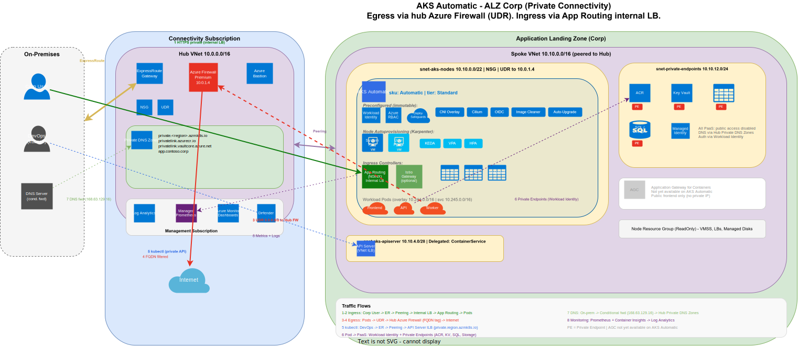
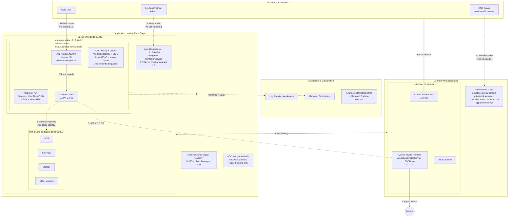

# AKS Automatic - Terraform (azapi) with ALZ Corp Integration

## Table of Contents

### Getting Started
- [Overview](#overview)
- [Quick Start](#quick-start)
- [Prerequisites](#prerequisites)
- [Deployment Scenarios](#deployment-scenarios)
- [Connect to the Cluster](#connect-to-the-cluster)
- [Post-Deployment Checklist](#post-deployment-checklist)

### Architecture
- [AKS Automatic vs AKS Standard](#aks-automatic-vs-aks-standard)
- [ALZ Corp Architecture Diagram](#alz-corp-architecture-diagram)
- [Traffic Flows](#traffic-flows)
- [BYO VNet Topology](#byo-vnet-topology)

### Security and Guardrails
- [AKS Automatic Platform Guardrails](#aks-automatic-platform-guardrails)
- [Terraform Module Guardrails](#terraform-module-guardrails)

### AKS Automatic Components
- [SKU and Cluster Tier](#sku-and-cluster-tier)
- [Node Provisioning (Karpenter)](#node-provisioning-karpenter)
- [Networking](#networking)
- [Ingress](#ingress)
- [Egress](#egress)
- [Security](#security)
- [Monitoring and Observability](#monitoring-and-observability)
- [Preconfigured vs Fine-Tunable](#preconfigured-vs-fine-tunable)

### ALZ Corp Integration
- [Azure Landing Zone Caveats](#azure-landing-zone-caveats)
- [Azure Policy Conflicts](#azure-policy-conflicts)
- [RBAC and Identity Requirements](#rbac-and-identity-requirements)

### Module Reference
- [Terraform Module Structure](#terraform-module-structure)

### Additional Documentation
- [Day-2 Operations](docs/day2-operations.md)
- [ArgoCD Bootstrap](docs/argocd/README.md)
- [Regional Availability](docs/regional-availability.md)
- [Networking: Cilium vs Cilium Enterprise](docs/networking-cilium.md)
- [References](#references)

---

## Overview

This repository contains a Terraform root module that deploys an **AKS Automatic** cluster using the **azapi provider** exclusively for all Azure resource creation. It is designed for deployment into an **Azure Landing Zone (ALZ) Corp** spoke subscription with private connectivity.

The module supports:

- BYO VNet target architecture with four subnets (nodes, API server, AGC, private endpoints). This module implements the node, API server, optional AGC, and private endpoint subnets in standalone mode, or consumes external subnet IDs in vending mode.
- Two egress options: User-Defined Routing through hub firewall (Corp default) and Standard Load Balancer (dev/test only). Managed NAT Gateway available only with AKS-managed VNet.
- Three ingress options: Application Routing add-on (managed NGINX, preconfigured), Application Gateway for Containers managed add-on (optional public preview on AKS Automatic), and Istio service mesh (optional).
- Private cluster with VNet-integrated API server
- Full ALZ hub-spoke integration with Azure Firewall, Private DNS Zones, and ExpressRoute
- HTTP proxy support for TLS-intercepting proxy environments ([docs](https://learn.microsoft.com/azure/aks/http-proxy))
- Microsoft Defender for Containers ([docs](https://learn.microsoft.com/azure/defender-for-cloud/defender-for-containers-introduction))
- Terraform guardrails: `prevent_destroy` lifecycle, input validation, cross-variable preconditions

---

## Quick Start

```bash
cp terraform.tfvars.example terraform.tfvars
# Edit terraform.tfvars for your environment

terraform init
terraform validate
terraform plan
terraform apply
```

## Prerequisites

**Tools:**
- Terraform >= 1.9
- Azure CLI authenticated (`az login`)
- azapi provider (downloaded automatically by `terraform init`)

**Azure subscription requirements:**
- Subscription quota for 16+ vCPUs of D-series VMs in the target region
- Region must support API Server VNet Integration (GA in all public regions except `qatarcentral`)
- `Microsoft.PolicyInsights` resource provider registered

**Before `terraform apply` (ALZ Corp):**
- **Remote backend:** Configure an Azure Storage backend for state persistence and locking. This module uses `prevent_destroy` on critical resources; local state is not suitable for production. Create a `backend.tf` with your storage account details.
- **Resource group:** Set `create_resource_group = false` to deploy into a pre-provisioned resource group (common for ALZ vending/adoption); the module constructs the RG ID in the current subscription.
- **Subnets (vending mode):** If using `external_*_subnet_id` variables, ensure the node subnet, API server subnet (delegated to `Microsoft.ContainerService/managedClusters`), optional AGC subnet (delegated to `Microsoft.ServiceNetworking/trafficControllers`), and PE subnet are pre-provisioned by the ALZ vending pipeline.
- **Firewall rules:** When using `egress_type = "userDefinedRouting"`, the hub Azure Firewall must whitelist all [AKS required outbound FQDNs](https://learn.microsoft.com/azure/aks/outbound-rules-control-egress). The `AzureKubernetesService` FQDN tag covers most requirements.
- **Private DNS zones:** For private clusters, ensure `private.<region>.azmk8s.io` Private DNS Zone exists in the connectivity subscription and is linked to the hub VNet.
- **Cross-subscription RBAC (not managed by this module):**
  - `Network Contributor` on the spoke VNet/subnets for the AKS cluster identity
  - `Private DNS Zone Contributor` on referenced private DNS zones for Application Routing
  - `DNS Zone Contributor` on referenced public DNS zones for Application Routing
  - `Key Vault Certificate User` on any Key Vault used for TLS certs
- **Log Analytics workspace:** Required when `enable_defender = true` or `enable_container_insights = true`. Pass the workspace resource ID via `log_analytics_workspace_id`.
- **UserAssigned identity:** Required when `private_dns_zone_id` is a custom resource ID. Create a managed identity with `Private DNS Zone Contributor` on the zone and pass its resource ID via `user_assigned_identity_id`.
- **CIDR coordination:** Verify that VNet, pod, and service CIDRs do not overlap with hub VNet, other spokes, or on-premises networks. See [CIDR Coordination](#cidr-coordination).

---

## AKS Automatic vs AKS Standard

The ARM API difference between AKS Automatic and AKS Standard:

```json
{
  "sku": {
    "name": "Automatic",
    "tier": "Standard"
  },
  "properties": {
    "nodeProvisioningProfile": {
      "mode": "Auto"
    }
  }
}
```

AKS Standard uses `"sku": { "name": "Base" }` and `"nodeProvisioningProfile": { "mode": "Manual" }`.

In AKS Automatic, many features that are optional in Standard become **preconfigured** (immutable) or **default** (enabled but adjustable). See [Preconfigured vs Fine-Tunable](#preconfigured-vs-fine-tunable) for the full breakdown.

---

## Architecture

### ALZ Corp Architecture Diagram

The following diagrams show AKS Automatic deployed in an ALZ Corp spoke subscription with private connectivity. The editable DrawIO source is at [`docs/alz-corp-aks-automatic.drawio`](docs/alz-corp-aks-automatic.drawio) ([open in diagrams.net](https://app.diagrams.net/#Uhttps%3A%2F%2Fraw.githubusercontent.com%2Fmartinopedal%2Fterraform-azapi-aks-automatic%2Fmain%2Fdocs%2Falz-corp-aks-automatic.drawio)).

#### Detailed Architecture



#### Schematic Traffic Flows



### Traffic Flows

| # | Flow | Path | Notes |
|---|---|---|---|
| 1-2 | **Ingress (Corp)** | Corp User -> ExpressRoute -> Hub -> Peering -> Internal LB -> App Routing (NGINX) -> Pods | Fully private via internal LB. AGC is optional public preview on AKS Automatic but AGC frontends are public today. |
| 3-4 | **Egress** | Pods -> UDR -> Hub Azure Firewall -> Internet | FQDN-filtered via `AzureKubernetesService` tag |
| 5 | **API access** | DevOps -> ExpressRoute -> Hub -> Peering -> API Server ILB | VNet-integrated; private cluster uses `private.<region>.azmk8s.io` DNS zone |
| 6 | **PaaS access** | Pods -> Private Endpoints (ACR, Key Vault, SQL, Storage) | Workload Identity authentication, no public access |
| 7 | **DNS** | On-prem DNS -> Conditional Forwarder (168.63.129.16) -> Hub Private DNS Zones | Resolves all private endpoints + API server FQDN |
| 8 | **Monitoring** | AKS -> Managed Prometheus + Container Insights -> Log Analytics | Central management subscription. Azure Monitor Dashboards built-in, Managed Grafana optional. |

---

## AKS Automatic Components

### SKU and Cluster Tier

| Property | Value | Notes |
|---|---|---|
| `sku.name` | `Automatic` | Triggers the Automatic experience |
| `sku.tier` | `Standard` | Always Standard tier, uptime SLA (99.95%), up to 5,000 nodes |
| Support plan | `KubernetesOfficial` | LTS available only on Premium tier with Standard SKU |

### Node Provisioning (Karpenter)

AKS Automatic uses **Node Autoprovisioning (NAP)** powered by Karpenter. No manually managed node pools exist. The cluster creates and right-sizes nodes based on pending pod resource requests.

| Property | Path | Configurable | Notes |
|---|---|---|---|
| Mode | `nodeProvisioningProfile.mode` | No, must be `Auto` | Core differentiator |
| Default pools | `nodeProvisioningProfile.defaultNodePools` | Yes (`None` / `Auto`) | Controls default Karpenter NodePool CRDs |
| System pool | `agentPoolProfiles[0]` | Partially | VM size dynamically selected based on quota |
| Node OS | Azure Linux | No | Preconfigured, immutable |
| Node auto-repair | Enabled | No | Preconfigured |
| Node resource group | ReadOnly | No | Locked to prevent changes |

Post-deployment tuning via Karpenter CRDs:

- `NodePool` CRDs: VM families, spot vs on-demand, taints, labels, topology spread, `.spec.limits` for vCPU/memory caps
- `AKSNodeClass` CRDs: OS disk type/size, node image version

### Networking

AKS Automatic uses **Azure CNI Overlay powered by Cilium** with eBPF-based data plane and integrated network policy enforcement.

| Component | Setting | Configurable |
|---|---|---|
| Network plugin | `azure` (CNI Overlay) | No |
| Network plugin mode | `overlay` | No |
| Network dataplane | `cilium` | No |
| Network policy engine | `cilium` | No |
| Load balancer SKU | `standard` | No |
| API server VNet integration | Enabled | No |
| Pod CIDR | Default `10.244.0.0/16` | Yes - `networkProfile.podCidr` |
| Service CIDR | Default `10.245.0.0/16` (module default) | Yes - `networkProfile.serviceCidr` |
| DNS service IP | Default `10.245.0.10` (module default) | Yes - `networkProfile.dnsServiceIP` |
| VNet | Managed (auto-created) | Yes - BYO VNet supported |
| Outbound type | `managedNATGateway` | Yes - see [Egress](#egress) |
| Service mesh | Not enabled | Yes - `serviceMeshProfile` for Istio |
| HTTP proxy | Not configured | Yes - `http_proxy_config` (see [HTTP Proxy](#http-proxy)) |

### HTTP Proxy

AKS supports [HTTP proxy configuration](https://learn.microsoft.com/azure/aks/http-proxy) for clusters deployed in environments where outbound internet access must route through a forward proxy. When configured, both nodes and pods receive the `HTTP_PROXY`, `HTTPS_PROXY`, and `NO_PROXY` environment variables automatically.

This module exposes the `http_proxy_config` variable, which maps to the ARM `httpProxyConfig` property:

| Field | Description |
|---|---|
| `http_proxy` | Proxy URL for HTTP connections (scheme must be `http`) |
| `https_proxy` | Proxy URL for HTTPS connections (falls back to `http_proxy` if not set) |
| `no_proxy` | List of destination domains, IPs, or CIDRs to exclude from proxying |
| `trusted_ca` | Base64-encoded PEM CA certificate bundle for TLS-intercepting proxies |

```hcl
http_proxy_config = {
  http_proxy  = "http://proxy.corp.contoso.com:8080"
  https_proxy = "http://proxy.corp.contoso.com:8080"
  no_proxy    = ["localhost", "127.0.0.1", "168.63.129.16", "10.0.0.0/8", "172.16.0.0/12"]
  trusted_ca  = "LS0tLS1CRUdJTi..."
}
```

**Limitations ([source](https://learn.microsoft.com/azure/aks/http-proxy#limitations-and-considerations)):**

- All node pools share the same proxy configuration (per-pool proxy is not supported)
- Windows node pools are not supported (not applicable to AKS Automatic, which is Linux-only)
- User/password authentication is not supported
- Custom CAs for API server communication are not supported
- The `trustedCa` certificate must include Subject Alternative Names (SANs)

**Corp considerations:** When using UDR egress through a hub firewall that also acts as a TLS-intercepting proxy, set `trusted_ca` to the proxy CA certificate bundle so that nodes can validate the intercepted TLS connections. Add the firewall IP and Azure metadata endpoint (`168.63.129.16`) to `no_proxy`.

### Ingress

AKS Automatic supports three ingress options, but they do not all use the same API model today. AGC uses the Kubernetes Gateway API. Application Routing currently uses Kubernetes `Ingress` resources. The AKS Istio add-on currently uses Istio CRDs for ingress and traffic management.

> **Ingress NGINX retirement notice:** The upstream Ingress NGINX project maintenance ended March 2026. Microsoft provides security patches for the Application Routing add-on NGINX through November 2026. AKS is migrating to the Kubernetes Gateway API as the long-term ingress standard. Plan migration to AGC (when private IP ships) or other Gateway API-compatible controllers.

#### Application Gateway for Containers (Gateway API, L7)

> **Preview caveat:** The AKS managed Application Gateway for Containers add-on is public preview on AKS Automatic. Keep `enable_app_gateway_for_containers = false` unless the consumer accepts preview support and AGC cost.
>
> **Corp caveat:** AGC frontends do not support private IP addresses today; frontends expose a public FQDN. For ALZ Corp scenarios requiring fully private ingress, use **Application Routing add-on with internal LB** or **Istio ingress gateway in Internal mode**.

AGC is Azure's L7 load balancer for AKS, built on the Kubernetes Gateway API. The managed add-on deploys the ALB Controller; Kubernetes `ApplicationLoadBalancer`, `Gateway`, and `HTTPRoute` resources then create and configure the Azure Application Gateway for Containers resources.

```
Client -> AGC Public Frontend -> ALB Controller -> Pods
```

| Aspect | Detail |
|---|---|
| AKS integration | AKS managed add-on: `ingressProfile.applicationLoadBalancer.enabled = true` plus `ingressProfile.gatewayAPI.installation = "Standard"` |
| Subnet | Dedicated subnet delegated to `Microsoft.ServiceNetworking/trafficControllers`, exactly /24 for CNI Overlay |
| Frontend | **Public FQDN only** (private IP not yet supported) |
| API model | `GatewayClass`, `Gateway`, `HTTPRoute` CRDs |
| WAF | Optional WAF policy on AGC security policy resource |
| TLS | SSL termination, ECDSA + RSA, end-to-end SSL, mTLS |
| Traffic splitting | Weighted round-robin via `HTTPRoute` weights (canary, blue-green) |
| Identity | `applicationloadbalancer-<cluster>` managed identity, auto-configured by add-on |
| Deployment modes | ALB-managed (`ApplicationLoadBalancer` CRD) or BYO (Terraform/ARM provisioned) |

Enable with:

```hcl
enable_app_gateway_for_containers = true
external_agc_subnet_id            = "/subscriptions/.../subnets/snet-agc" # vending mode
```

In standalone network mode, the module creates `agc_subnet_name` (`snet-agc`) with `agc_subnet_address_prefix` (`10.10.8.0/24`) and the required `Microsoft.ServiceNetworking/trafficControllers` delegation. In external-subnet mode, the vending pipeline must create and delegate the subnet and pass `external_agc_subnet_id`. The add-on creates the managed identity `applicationloadbalancer-<cluster-name>`; ensure it has permission to join/configure the AGC subnet before applying `ApplicationLoadBalancer` CRDs if the subnet is outside the node resource group.

See [Application Gateway for Containers components](https://learn.microsoft.com/azure/application-gateway/for-containers/application-gateway-for-containers-components) and the [AKS managed add-on quickstart](https://learn.microsoft.com/azure/application-gateway/for-containers/quickstart-deploy-application-gateway-for-containers-alb-controller-addon).

#### Application Routing Add-on (managed NGINX / Ingress API, preconfigured) - recommended for fully private ALZ Corp

Always enabled on AKS Automatic. Deploys a managed NGINX-based controller that currently uses `Ingress` resources with `ingressClassName: webapprouting.kubernetes.azure.com`. Supports **internal Azure Load Balancer** for fully private ingress.

```
Corp User -> ExpressRoute -> Peering -> Internal LB -> App Routing Ingress -> Pods
```

| Feature | Configuration |
|---|---|
| Current API | `Ingress` with `ingressClassName: webapprouting.kubernetes.azure.com` |
| DNS integration | `ingressProfile.webAppRouting.dnsZoneResourceIds` (public and private zones) |
| TLS from Key Vault | Reference certs on `Ingress` resources with `kubernetes.azure.com/tls-cert-keyvault-uri`, automatic rotation |
| Internal-only | `service.beta.kubernetes.io/azure-load-balancer-internal: "true"` annotation on Service |
| Private frontend | ✅ Fully supported via internal Azure Load Balancer |

Corp considerations: Configure as internal LB only. Create DNS records in the hub Private DNS Zone pointing to the internal LB IP. This is the recommended ingress for ALZ Corp until AGC adds private IP frontend support. AKS will evolve Application Routing toward Gateway API alignment, but it does not use `GatewayClass`, `Gateway`, or `HTTPRoute` today.

#### Istio Service Mesh Ingress Gateway (optional)

Envoy-based ingress for service mesh scenarios. Traffic management uses Istio `VirtualService` and `DestinationRule` CRDs, and ingress exposure is configured via the Istio `Gateway` CRD (not the Kubernetes Gateway API). Supports **internal mode** for fully private ingress.

```
Corp User -> ExpressRoute -> Peering -> Internal Istio Gateway -> VirtualService -> Pods
```

| Component | Configuration |
|---|---|
| Enable | `serviceMeshProfile.mode = "Istio"` |
| Ingress gateway | `istio.components.ingressGateways[].enabled = true` |
| Internal mode | Set `mode: "Internal"` for corp-only access |
| Current API | Istio `Gateway`, `VirtualService`, and `DestinationRule` CRDs |
| mTLS | `PeerAuthentication` CRDs |
| Private frontend | ✅ Fully supported via internal Azure Load Balancer |

Corp considerations: Use `Internal` mode. When combined with UDR egress, the hub firewall must allow return traffic to the Istio LB frontend IP. Kubernetes Gateway API support in the AKS Istio add-on is planned but not yet available.

#### Ingress Comparison

| | AGC | App Routing (NGINX) | Istio Gateway |
|---|---|---|---|
| AKS Automatic support | ❌ add-on not yet available | ✅ preconfigured | ✅ opt-in |
| Gateway API | ✅ | Ingress API (Gateway API planned) | Istio Gateway CRD (K8s Gateway API planned) |
| L7 features | WAF, mTLS, rewrites, traffic splits | Host/path routing, TLS | Traffic mgmt, mTLS, fault injection |
| Private IP frontend | ❌ not yet supported | ✅ internal LB | ✅ internal mode |
| ALZ Corp recommended | ❌ until add-on + private IP ship | **✅ Primary for Corp** | ✅ Service mesh scenarios |
| Managed by | Azure (AGC resource) | AKS (in-cluster) | AKS (in-cluster) |

### Egress

In an ALZ Corp deployment, the standard pattern is **UDR through the hub Azure Firewall**. Three egress patterns are available depending on the VNet configuration.

#### Managed NAT Gateway (managed VNet only)

```
Pods -> Node -> Managed NAT Gateway -> Internet
```

- `enable_byo_vnet = false`
- AKS creates and manages the NAT Gateway. No configuration available.
- Not suitable for Corp: egress is unfiltered with no centralised logging.

#### Standard Load Balancer (BYO VNet, dev/test only)

```
Pods -> Node -> AKS Standard LB (SNAT) -> Internet
```

- `egress_type = "loadBalancer"`
- No additional resources created.
- Limited SNAT ports (~1k per node), no static outbound IP, SNAT exhaustion risk.

#### User-Defined Routing (BYO VNet, recommended for ALZ Corp)

```
Pods -> Node -> UDR 0.0.0.0/0 -> Hub Azure Firewall -> Internet
```

- `egress_type = "userDefinedRouting"`, `firewall_private_ip` required.
- Creates Route Table with default route to the hub firewall private IP.
- Centralised FQDN filtering, compliance logging, DLP.

**Required outbound FQDNs** (Azure Firewall `AzureKubernetesService` FQDN tag covers most):

| FQDN | Port | Purpose |
|---|---|---|
| `*.hcp.<region>.azmk8s.io` | 443 | API server communication for public clusters |
| `mcr.microsoft.com` | 443 | System container images |
| `*.data.mcr.microsoft.com` | 443 | MCR data endpoint |
| `mcr-0001.mcr-msedge.net` | 443 | MCR CDN endpoint |
| `management.azure.com` | 443 | Azure Resource Manager |
| `login.microsoftonline.com` | 443 | Entra ID authentication |
| `packages.microsoft.com` | 443 | Azure Linux packages |
| `acs-mirror.azureedge.net` | 443 | Azure Linux mirror |
| `dc.services.visualstudio.com` | 443 | Container Insights telemetry |
| `*.monitoring.azure.com` | 443 | Managed Prometheus |
| `*.ods.opinsights.azure.com` | 443 | Log Analytics ingestion |

> **Note:** `*.hcp.<region>.azmk8s.io` is not required for private clusters.

Additional rules beyond the FQDN tag:

| FQDN | Purpose |
|---|---|
| `<acr-name>.azurecr.io` | Application container images |
| Helm chart registries | Third-party charts |
| Workload-specific external APIs | Application dependencies |

Azure Firewall sizing: minimum 20 frontend public IPs in production to avoid SNAT exhaustion. The route table applies to the **node subnet only**. The API server subnet must not have a route table.

#### Egress Comparison

| | Managed NAT GW | Load Balancer | UDR |
|---|---|---|---|
| BYO VNet | ❌ | ✅ | ✅ |
| Static outbound IP | ❌ | ❌ | Via firewall |
| SNAT ports | High (auto) | ~1k per node | Via firewall |
| Centralised filtering | ❌ | ❌ | ✅ |
| ALZ Corp suitable | ❌ | ❌ | ✅ |
| Terraform setting | `enable_byo_vnet = false` | `egress_type = "loadBalancer"` | `egress_type = "userDefinedRouting"` |

### Security

| Component | Setting | Configurable |
|---|---|---|
| Authentication and authorisation | Azure RBAC for Kubernetes | No, local accounts disabled |
| Workload Identity | Entra Workload ID | No |
| OIDC Issuer | Enabled | No |
| API server VNet integration | Enabled | No |
| Image Cleaner | Enabled, default 7-day interval | Yes - `image_cleaner_interval_hours` (minimum 24) |
| Deployment Safeguards | Azure Policy, Warning mode | No (severity adjustable via Policy) |
| Defender for Containers | Optional | Yes - `enable_defender` + `log_analytics_workspace_id` |
| Azure Key Vault KMS | Optional | Yes - `enable_kms` + `kms_key_id` |
| Custom CA trust certs | Optional, up to 10 | Conditional - see caveat below |
| Key Vault purge protection | Enabled by default | Yes - `enable_purge_protection` (irreversible once enabled) |
| Private cluster | Optional | Yes - `enable_private_cluster` |
| Authorised IP ranges | Optional | Yes - `authorized_ip_ranges` |

> **Custom CA trust certificates:** Supported on NAP-enabled AKS Automatic clusters starting with AKS release v20260408. Use `securityProfile.customCATrustCertificates` only when the cluster version is >= v20260408. See [GitHub issue #5353](https://github.com/Azure/AKS/issues/5353).

### Monitoring and Observability

| Component | Default State | Configurable |
|---|---|---|
| Managed Prometheus | Not enabled | Yes - `enable_prometheus` |
| Container Insights | Not enabled | Yes - `enable_container_insights` + `log_analytics_workspace_id` |
| Azure Monitor Dashboards | Built-in via portal, no Managed Grafana resource created | Link Managed Grafana outside this module if needed |
| ACNS network observability | Not enabled | Yes - `enable_acns` |
| Cost analysis | Not enabled | Yes - `enable_cost_analysis` |

### Cost

AKS Automatic has an irreducible cost floor: the mandatory **Standard** control-plane tier (about **$73/month**) plus at least one system node. This module keeps optional paid features off by default: `enable_defender = false`, `enable_cost_analysis = false`, `enable_prometheus = false`, `enable_prometheus_alerts = false`, `enable_container_insights = false`, and `enable_app_gateway_for_containers = false`.

Cheap levers:

- `system_node_vm_size = "Standard_D2s_v5"` by default. This is the smallest reliable D-series choice for AKS Automatic/NAP default pools. NAP's default `NodePool` constrains user nodes to SKU family `D`, so burstable B-series (for example `Standard_B2s`) is not the safe default.
- Use `create_resource_group = false` for ALZ-adopted resource groups to avoid state ownership of shared RGs.
- Keep AGC, Defender, Prometheus, Container Insights, cost analysis, ACR, and Key Vault disabled unless the demo explicitly needs them.
- To constrain NAP user nodes further, apply Karpenter `NodePool` / `AKSNodeClass` CRDs after cluster creation (for example with `karpenter.azure.com/sku-name`). This module does not add a Kubernetes provider to avoid kube-auth complexity.

### Auto-Upgrade and Maintenance

| Component | Setting | Configurable |
|---|---|---|
| Cluster auto-upgrade | `stable` channel | Yes - `upgrade_channel` |
| Node OS upgrade | `NodeImage` channel | Yes - `node_os_upgrade_channel` |
| K8s API deprecation detection | Enabled | No |
| Planned maintenance windows | Configurable | Yes - `maintenance_window` variable |

### Scaling

| Component | Setting | Configurable |
|---|---|---|
| Node Autoprovisioning (NAP) | Enabled | No |
| HPA | Enabled | Yes - per deployment |
| KEDA | Enabled | Yes - `workloadAutoScalerProfile.keda` |
| VPA | Enabled | Yes - `workloadAutoScalerProfile.verticalPodAutoscaler` |
| Cluster autoscaler profile | Available | Yes - `autoScalerProfile.*` |

### Storage

| Component | Default | Configurable |
|---|---|---|
| Azure Disk CSI | Enabled | Yes - `storageProfile.diskCSIDriver` |
| Azure Files CSI | Enabled | Yes - `storageProfile.fileCSIDriver` |
| Azure Blob CSI | Disabled | Yes - `storageProfile.blobCSIDriver` |
| Snapshot controller | Enabled | Yes - `storageProfile.snapshotController` |

### Policy Enforcement

| Component | Setting | Configurable |
|---|---|---|
| Deployment Safeguards | Warning mode | Severity changeable to Enforcement |
| Custom Azure Policies | Not assigned | Yes |
| Managed namespaces | Not enabled | Yes |

---

## Preconfigured vs Fine-Tunable

### Preconfigured (immutable)

The following are always enabled on AKS Automatic and cannot be disabled or changed:

- Node Autoprovisioning mode = `Auto`
- Azure Linux node OS
- Azure CNI Overlay + Cilium
- Azure RBAC for Kubernetes authorisation (local accounts disabled)
- Workload Identity + OIDC Issuer
- API server VNet integration
- Image Cleaner
- Deployment Safeguards (Azure Policy)
- Managed NAT Gateway (when using managed VNet)
- Application Routing add-on (managed NGINX)
- Node auto-repair
- Standard tier with uptime SLA
- ReadOnly node resource group
- K8s API deprecation detection on upgrade

### Fine-tunable

| Category | Parameters |
|---|---|
| Kubernetes version | `kubernetes_version` |
| Upgrade channels | `upgrade_channel`, `node_os_upgrade_channel` |
| Maintenance windows | `maintenanceConfigurations` |
| Networking | BYO VNet, pod/service CIDRs, DNS service IP, HTTP proxy |
| Egress | UDR through hub firewall (Corp default), Load Balancer (dev/test only) |
| Ingress | DNS zones for App Routing, Istio. AGC documented for reference but not yet supported on AKS Automatic. |
| Private cluster | `enable_private_cluster`, `authorized_ip_ranges` |
| Monitoring | Prometheus, Container Insights, Managed Grafana, cost analysis |
| Scaling | KEDA, VPA, HPA, autoscaler profile |
| Storage | Disk/File/Blob CSI drivers, snapshot controller |
| Security | Defender, Key Vault KMS, image cleaner interval, purge protection, CA trust certs (requires AKS >= v20260408 for NAP) |
| HTTP proxy | `http_proxy_config` for TLS-intercepting proxy environments |
| Node customisation | Karpenter `NodePool` / `AKSNodeClass` CRDs post-deployment |

---

## AKS Automatic Platform Guardrails

AKS Automatic ships with built-in platform-level guardrails that are always active. These complement the Terraform-level guardrails below.

| Guardrail | Mechanism | Configurable | Impact |
|---|---|---|---|
| Deployment Safeguards | Azure Policy (Warning mode by default) | Yes - severity changeable to Enforcement via Policy | Prevents unsafe pod specs before deployment |
| Cilium Network Policies | eBPF-based L3/L4/L7 enforcement | Yes - via `CiliumNetworkPolicy` CRDs | Enforces pod-to-pod and external traffic rules |
| Image Cleaner | Automatic unused image removal | Yes - `image_cleaner_interval_hours` (min 24h) | Prevents stale vulnerable images on nodes |
| Azure RBAC | Kubernetes API auth via Entra ID | No - preconfigured, local accounts disabled | All cluster access requires Entra ID identity |
| Workload Identity + OIDC | Federated token credentials for pods | No - preconfigured | Pods authenticate to Azure services without secrets |
| ReadOnly Node Resource Group | ARM lock on MC_ resource group | No - preconfigured | Prevents manual tampering with AKS-managed infra |
| API Server VNet Integration | API server as ILB in delegated subnet | No - preconfigured (BYO VNet) | No public kube-apiserver endpoint in BYO VNet mode |
| Auto-Upgrade | Cluster and node OS patching | Yes - `upgrade_channel`, `node_os_upgrade_channel` | Cluster stays on supported Kubernetes versions |
| CNI Overlay + Cilium | Azure CNI with non-routable pod CIDR | No - preconfigured | Pod IPs don't consume VNet address space |

## Terraform Module Guardrails

This module includes several Terraform-level safeguards to prevent misconfigurations and accidental data loss. These complement the Azure-side guardrails (Deployment Safeguards, Azure Policy) that AKS Automatic enables by default.

### Lifecycle Protection

The AKS cluster and resource group resources include [`prevent_destroy`](https://developer.hashicorp.com/terraform/language/meta-arguments/lifecycle#prevent_destroy) lifecycle blocks. This prevents accidental deletion via `terraform destroy` or resource removal from configuration. To intentionally destroy protected resources, temporarily remove the lifecycle block or use `terraform state rm`.

The AKS cluster also uses [`ignore_changes`](https://developer.hashicorp.com/terraform/language/meta-arguments/lifecycle#ignore_changes) on `kubernetesVersion` to prevent Terraform from reverting auto-upgrade version changes. When `upgrade_channel` is set (default: `stable`), AKS upgrades the cluster version automatically. Without `ignore_changes`, every subsequent `terraform plan` would show a diff and risk an unintended version change.

### Input Validation

All CIDR and IP address variables include `validation` blocks that verify correct format at `terraform plan` time, before any Azure API calls. The following validations are enforced:

| Variable | Validation |
|---|---|
| `vnet_address_space`, `node_subnet_address_prefix`, `pe_subnet_address_prefix`, `pod_cidr`, `service_cidr` | Must be valid CIDR notation |
| `apiserver_subnet_address_prefix` | Must be valid CIDR and /28 or larger |
| `dns_service_ip` | Must be a valid IPv4 address (no CIDR mask) |
| `acr_name` | 5-50 alphanumeric characters ([naming rules](https://learn.microsoft.com/azure/container-registry/container-registry-concepts#registry-name)) |
| `keyvault_name` | 3-24 characters, start with letter, alphanumeric and hyphens ([naming rules](https://learn.microsoft.com/azure/key-vault/general/about-keys-secrets-certificates#objects-identifiers-and-versioning)) |
| `image_cleaner_interval_hours` | Minimum 24 hours |
| `egress_type` | Must be `userDefinedRouting` or `loadBalancer` |
| `upgrade_channel` | Must be `rapid`, `stable`, `patch`, or `node-image` |
| `node_os_upgrade_channel` | Must be `NodeImage`, `SecurityPatch`, `Unmanaged`, or `None` |

### Cross-Variable Preconditions

The module uses Terraform [`precondition`](https://developer.hashicorp.com/terraform/language/expressions/custom-conditions#preconditions-and-postconditions) blocks to catch invalid variable combinations before deployment:

| Precondition | Error caught |
|---|---|
| External subnet IDs must be all-or-none | Setting `external_node_subnet_id` without `external_apiserver_subnet_id` (or vice versa) would produce a broken cluster payload |
| Custom `private_dns_zone_id` blocked with SystemAssigned identity | Custom private DNS zones [require UserAssigned identity](https://learn.microsoft.com/azure/aks/private-clusters#configure-a-private-dns-zone); this module uses SystemAssigned |
| `firewall_private_ip` required for UDR egress | Omitting the firewall IP when `egress_type = userDefinedRouting` would create a route table with no next hop. Applies only in standalone BYO VNet mode (not vending mode, where the UDR is pre-provisioned). |
| `log_analytics_workspace_id` required for Defender | [Defender for Containers](https://learn.microsoft.com/azure/defender-for-cloud/defender-for-containers-introduction) requires a Log Analytics workspace for security event storage |
| `acr_name` required when `create_acr = true` | Prevents plan failure from missing required resource name |
| `keyvault_name` required when `create_keyvault = true` | Prevents plan failure from missing required resource name |
| PE subnet required for ACR/KV with public access disabled | ACR and Key Vault are created with `publicNetworkAccess = Disabled` and need a private endpoint subnet |
| External subnet IDs blocked when `enable_byo_vnet = false` | Prevents conflicting configuration where external subnets are combined with managed VNet egress |
| `http_proxy_config` requires at least one proxy URL | Prevents setting an empty proxy config with neither `http_proxy` nor `https_proxy` defined |

### Security Defaults

The module applies secure defaults that can be overridden when needed:

| Default | Rationale | Override variable |
|---|---|---|
| Key Vault [purge protection](https://learn.microsoft.com/azure/key-vault/general/soft-delete-overview#purge-protection) enabled | Prevents permanent deletion of secrets during soft-delete retention. This setting is irreversible. | `enable_purge_protection` |
| ACR [zone redundancy](https://learn.microsoft.com/azure/container-registry/zone-redundancy) enabled | Protects against single availability zone failures for container image pulls | `acr_zone_redundancy_enabled` |
| ACR public access disabled | Forces all image pulls through private endpoints | N/A (always disabled) |
| Key Vault public access disabled | Forces all secret/certificate access through private endpoints | N/A (always disabled) |
| AKS local accounts disabled | Forces Azure RBAC authentication ([docs](https://learn.microsoft.com/azure/aks/manage-azure-rbac)) | N/A (preconfigured by AKS Automatic) |

---

## BYO VNet Topology

This section shows the target ALZ Corp topology. The module implements the node subnet, API server subnet, optional AGC subnet (when `enable_app_gateway_for_containers = true` in standalone mode), and private endpoint subnet (when `create_acr` or `create_keyvault` is true in standalone mode).

```
Spoke VNet: 10.10.0.0/16 (peered to Hub VNet)

  snet-aks-nodes         10.10.0.0/22    NSG + UDR -> Hub Firewall
    AKS Automatic cluster
      System Pool + Karpenter NodePools (Azure Linux)
      App Routing (Ingress API) | Istio | AGC (optional, public frontend today)
      Pods (overlay: 10.244.0.0/16, services: 10.245.0.0/16)

  snet-aks-apiserver     10.10.4.0/28    Delegated: Microsoft.ContainerService/managedClusters
    K8s API Server (VNet integrated ILB; FQDN: <cluster>-<hash>.<region>.azmk8s.io)
    Private cluster uses the private.<region>.azmk8s.io DNS zone

  snet-agc               10.10.8.0/24    Delegated: Microsoft.ServiceNetworking/trafficControllers
    Application Gateway for Containers (public frontend today)

  snet-private-endpoints 10.10.12.0/24
    Private Endpoints: ACR, Key Vault, Storage, SQL/CosmosDB
```

### Subnet Sizing

| Subnet | Minimum | Recommended | Notes |
|---|---|---|---|
| Node subnet | /24 (254 nodes) | /22 (1,022 nodes) | One IP per node. Pod IPs from overlay, not this subnet. |
| API server subnet | /28 (11 usable) | /28 | API server endpoint only. /28 is sufficient. |
| AGC subnet | /24 (256 IPs) | /24 | Required by AGC. Dedicated and delegated. |
| Private endpoints | /24 | /24 | ACR, Key Vault, Storage, database PEs. |

### Subnet Requirements

- The API server subnet MUST have delegation to `Microsoft.ContainerService/managedClusters`.
- The API server subnet MUST NOT have a NAT Gateway or Route Table.
- The AGC subnet MUST have delegation to `Microsoft.ServiceNetworking/trafficControllers`.
- The node subnet SHOULD have an NSG and a UDR for Corp egress.
- All subnets must be in the same VNet and region.
- No CIDR overlaps between VNet address space, pod CIDR, service CIDR, hub VNet, and on-premises networks.

---

## Azure Landing Zone Caveats

This module deploys into a **Corp spoke subscription** within an Azure Landing Zone using [Azure Verified Modules (AVM) for Platform Landing Zones](https://aka.ms/alz/acc/tf). The following caveats and implementation considerations apply.

### VNet and Subnet Ownership

In ALZ, the connectivity subscription owns the hub VNet and the platform team manages peering. This module can either create its own spoke VNet in `network.tf` or consume pre-provisioned subnets via the external subnet ID inputs.

**What you must handle externally:**

- Peer the spoke VNet to the ALZ hub. This module does not create peering resources.
- If the platform team pre-provisions spoke VNets, keep `enable_byo_vnet = true` and pass `external_node_subnet_id`, `external_apiserver_subnet_id`, and `external_pe_subnet_id` as needed. `network.tf` is skipped automatically when external subnet IDs are supplied.

### CIDR Coordination

ALZ enforces centralised IP address management (IPAM). The default CIDRs in this module (`10.10.0.0/16` VNet, `10.244.0.0/16` pod overlay, `10.245.0.0/16` services) must not overlap with:

- Hub VNet CIDR (typically `10.0.0.0/16`)
- Other spoke VNets
- On-premises address space connected via ExpressRoute or VPN
- Other AKS clusters sharing DNS or service mesh

**Action:** Coordinate all CIDR allocations with the ALZ platform team before deployment. Update `variables.tf` defaults to match allocated ranges.

### Private DNS Zone Management

AKS Automatic always uses **API Server VNet Integration**. The API server runs behind an internal load balancer (ILB) injected directly into the delegated API server subnet. This is not the legacy Private Link-based model.

DNS resolution depends on whether the cluster is public or private:

| Mode | FQDN format | Resolves to | Private DNS Zone |
|---|---|---|---|
| Public | `<cluster>-<hash>.<region>.azmk8s.io` | Public IP | Not required |
| Private | `<cluster>-<hash>.private.<region>.azmk8s.io` | ILB private IP in API server subnet | `private.<region>.azmk8s.io` |

In both modes, nodes communicate with the API server via the ILB private IP directly, bypassing DNS entirely. The DNS zone is only relevant for out-of-cluster clients (kubectl, CI/CD pipelines, on-premises users).

The `privateDNSZone` property (ARM) / `--private-dns-zone` flag (CLI) controls zone creation for private clusters:

| Setting | Behaviour |
|---|---|
| `system` (default) | AKS creates a `private.<region>.azmk8s.io` zone in the node resource group, linked to the cluster VNet only. |
| `none` | No zone created. API server reachable only via public FQDN (if public access is also enabled). |
| `<resource-id>` | Use a pre-created zone in e.g. the ALZ connectivity subscription. Format: `private.<region>.azmk8s.io`. |

**Implementation guidance for ALZ hub-spoke:**

> **Module limitation:** This module uses a SystemAssigned managed identity. Custom private DNS zone resource IDs [require a UserAssigned managed identity](https://learn.microsoft.com/azure/aks/private-clusters#configure-a-private-dns-zone). To use a shared ALZ `private.<region>.azmk8s.io` zone from the connectivity subscription, extend the `identity` block in `main.tf` to UserAssigned and relax the corresponding precondition. Until then, use `private_dns_zone_id = null` (default, system-managed zone) or `private_dns_zone_id = "none"`.

- The recommended ALZ pattern uses `privateDNSZone = "<resource-id>"` pointing to a pre-created `private.<region>.azmk8s.io` zone in the connectivity subscription. The zone must be linked to both hub and spoke VNets. This requires extending this module to UserAssigned identity.
- The cluster managed identity requires `Private DNS Zone Contributor` and `Network Contributor` on the zone.
- On-premises DNS servers need a conditional forwarder for `private.<region>.azmk8s.io` to Azure DNS (`168.63.129.16`) via the hub.
- For public VNet-integrated clusters: no Private DNS Zone is needed. Restrict external access using `authorized_ip_ranges`.
- For Application Routing DNS: pass pre-existing zone resource IDs via `dns_zone_resource_ids`. The AKS managed identity requires `Private DNS Zone Contributor` on private zones and `DNS Zone Contributor` on public zones. These role assignments are not created by this module and must be managed externally.
- For AGC frontends: add a CNAME in the appropriate Private DNS Zone pointing to the generated `*.appgw.azure.com` FQDN.

**Sources:**
- [API Server VNet Integration](https://learn.microsoft.com/azure/aks/api-server-vnet-integration) - ILB-based model, DNS behaviour, public/private toggle
- [Private AKS clusters](https://learn.microsoft.com/azure/aks/private-clusters) - `privateDNSZone` options, hub-spoke DNS configuration
- [AKS Automatic private cluster quickstart](https://learn.microsoft.com/azure/aks/automatic/quick-automatic-private-custom-network) - Identity and subnet requirements

### Egress Through Hub Firewall

The standard ALZ Corp pattern routes all spoke egress through the hub Azure Firewall via UDR.

**Configuration:** Set `egress_type = "userDefinedRouting"` and `firewall_private_ip` to the hub firewall's private IP.

**Firewall policy requirements:**

The `AzureKubernetesService` FQDN tag on Azure Firewall covers most AKS system requirements. Additional rules are needed for:

- Container registries: `<acr-name>.azurecr.io`, `ghcr.io`, `docker.io`
- Helm chart repositories
- External APIs consumed by workloads
- Azure Linux packages: `packages.microsoft.com`, `acs-mirror.azureedge.net`, `mcr-0001.mcr-msedge.net`

If the ALZ uses a third-party NVA instead of Azure Firewall, the `AzureKubernetesService` FQDN tag is not available. Each required FQDN must be whitelisted individually per the [AKS required outbound rules](https://learn.microsoft.com/azure/aks/outbound-rules-control-egress).

### Azure Policy Conflicts

ALZ assigns Azure Policies at the management group level. AKS Automatic preconfigures Deployment Safeguards which internally uses Azure Policy. Conflicts between ALZ policies and AKS Automatic defaults can cause cluster creation failures.

**Known conflict areas:**

| ALZ Policy | Conflict | Resolution |
|---|---|---|
| `Kubernetes clusters should not allow container privilege escalation` | May block AKS system components | Request exemption for `kube-system` namespace |
| `Kubernetes cluster should not allow privileged containers` | AKS system pods require privileges | Request exemption for system DaemonSets |
| `Network policies should be enforced on AKS clusters` | Already enforced by Cilium but policy may not detect this | Request exemption or update policy to recognise Cilium |
| Policies enforcing specific NSG rules | AKS injects its own NSG rules that may violate strict policies | Request exemption on AKS node subnet |
| `Deny-PublicEndpoints` / `Deny-PublicIP` | Blocks public endpoints on PaaS services | Module is compliant: ACR, Key Vault, and optionally AKS API server are private-only |
| `Deploy-Diag-LogsCat` (DeployIfNotExists) | Auto-deploys diagnostic settings on resources missing them | Module does not create diagnostic settings; ALZ auto-remediation will add them. Pass `log_analytics_workspace_id` for Defender integration. |
| Tag enforcement policies | May require specific tags (e.g. `costCenter`, `owner`) not included in defaults | Add required tags to the `tags` variable input |

**Sources:**
- [ALZ Policy assignments](https://github.com/Azure/Azure-Landing-Zones-Library/tree/main/platform/alz/policy_assignments)
- [ALZ Policy documentation](https://azure.github.io/Azure-Landing-Zones/policy/)

**Action:** Audit ALZ policy assignments before deploying:

```bash
az policy assignment list --scope /subscriptions/<subscription-id> --output table
```

Request exemptions from the platform team for policies incompatible with AKS Automatic.

### azapi vs AVM Compatibility

This module uses `azapi_resource` for all Azure resources. AVM modules use `azurerm_*` resources.

**Rules:**

- Do not manage the same resource with both `azapi_resource` and `azurerm_*` in separate configurations. This causes state conflicts and drift.
- Reference AVM-managed resources (VNet, Key Vault, DNS Zones) via data sources or resource ID variables, not by importing into this Terraform state.
- When the ALZ platform team uses the [AVM Platform Landing Zone module](https://registry.terraform.io/modules/Azure/avm-ptn-alz/azurerm/latest), coordinate output values: hub firewall IP, peering resource IDs, Private DNS zone IDs, Log Analytics workspace ID.

### RBAC and Identity Requirements

AKS Automatic enforces Azure RBAC for Kubernetes (`aadProfile.enableAzureRBAC = true`, local accounts disabled).

The cluster's SystemAssigned managed identity requires the following role assignments, which are **not created by this module**:

| Role | Scope | Purpose |
|---|---|---|
| `Network Contributor` | BYO VNet and subnets | Node provisioning, subnet joins. Created by this module in standalone mode; must be granted externally in vending mode. |
| `Private DNS Zone Contributor` | Private DNS zones in connectivity subscription | Application Routing private DNS record management |
| `DNS Zone Contributor` | Public DNS zones | Application Routing public DNS record management |
| `Key Vault Certificate User` | Key Vault(s) for TLS certs | Application Routing TLS certificate retrieval |
| `AcrPull` | Azure Container Registry | Pull application container images |

In ALZ, these are cross-subscription RBAC assignments that must be managed by the platform team or a separate Terraform state.

### Monitoring Integration

ALZ deploys a central Log Analytics workspace in the management subscription. This module accepts `log_analytics_workspace_id` as an input variable. When `enable_defender = true`, the workspace ID is passed to `securityProfile.defender.logAnalyticsWorkspaceResourceId` for [Defender for Containers](https://learn.microsoft.com/azure/defender-for-cloud/defender-for-containers-introduction) security event storage.

For Prometheus metrics and Container Insights log forwarding to a central workspace, set `enable_prometheus = true` and/or `enable_container_insights = true` with the required workspace IDs. Both are disabled by default to keep the cheapest cluster footprint.

When `enable_cost_analysis = true`, the module enables [AKS cost analysis](https://learn.microsoft.com/azure/aks/cost-analysis) via `metricsProfile.costAnalysis`, which provides per-namespace and per-workload cost breakdown in Azure Cost Management.

### If Using ALZ Subscription Vending with AVNM IPAM

If the ALZ platform uses the [AVM Subscription Vending module](https://github.com/Azure/bicep-registry-modules/tree/main/avm/ptn/lz/sub-vending) to provision application landing zone subscriptions, and the network team has customised it with [Azure Virtual Network Manager (AVNM) IPAM](https://learn.microsoft.com/azure/virtual-network-manager/concept-ip-address-management) for centralised IP address allocation, the following considerations change compared to the default BYO VNet path documented above.

**VNet, resource group, and subnets are pre-provisioned by the vending pipeline.** The subscription vending module creates the spoke VNet, subnets, hub peering, NSG, UDR, and often the workload resource group before this AKS module runs. In this mode, keep `enable_byo_vnet = true`, set `create_resource_group = false`, and pass the pre-existing subnet resource IDs via `external_node_subnet_id`, `external_apiserver_subnet_id`, `external_agc_subnet_id` (when AGC is enabled), and `external_pe_subnet_id` as needed. When external node/API subnet IDs are supplied, `network.tf` is skipped automatically.

**CIDR ranges are allocated from AVNM IPAM pools, not manually.** The `vnet_address_space`, `node_subnet_address_prefix`, and `apiserver_subnet_address_prefix` variables become irrelevant. The vending pipeline controls these via IPAM pool reservations. The overlay CIDRs (`pod_cidr`, `service_cidr`) are not part of the VNet address space (they exist in the overlay) but still must not overlap with any routable address space in the IPAM plan. Coordinate these with the network team.

**Subnet delegations must be configured in the vending pipeline.** The API server subnet requires delegation to `Microsoft.ContainerService/managedClusters` and the AGC subnet requires delegation to `Microsoft.ServiceNetworking/trafficControllers`. These delegations must be part of the vending module's subnet definitions, not applied by this module after the fact.

**Peering and route tables are handled by the vending pipeline.** The subscription vending module typically creates hub-spoke peering and attaches the UDR (pointing to the hub firewall) to the node subnet as part of provisioning. The NSG and route table resources in `network.tf` are not needed.

**Terraform state boundaries.** The vending module uses `azurerm` (AVM convention). This module uses `azapi`. They operate in separate Terraform states. Pass subnet IDs as input variables. Do not use `data` source lookups across states, as that creates implicit dependencies that break when the vending pipeline runs independently.

**Summary of what changes:**

| Concern | Default BYO VNet (this module) | Subscription Vending + AVNM IPAM |
|---|---|---|
| VNet creation | This module (`network.tf`) | Vending pipeline |
| Subnet creation | This module (`network.tf`) | Vending pipeline |
| CIDR allocation | Manual (`variables.tf` defaults) | AVNM IPAM pools |
| Subnet delegations | This module (`network.tf`) | Vending pipeline subnet definitions |
| Hub peering | External (manual) | Vending pipeline (automatic) |
| NSG + UDR | This module (`network.tf`) | Vending pipeline / AVNM security admin rules |
| Input to this module | `enable_byo_vnet = true` | `enable_byo_vnet = true` + external subnet ID variables |
| Terraform provider | `azapi` | Vending uses `azurerm`, this module uses `azapi`  - separate states |

---

## Terraform Module Structure

```
terraform-azapi-aks-automatic/
├── terraform.tf              # Terraform block, providers
├── data.tf                   # Data source (client config)
├── locals.tf                 # Computed values, conditional logic
├── variables.tf              # All input variables
├── network.tf                # BYO VNet resources (conditional)
├── dependencies.tf           # ACR, Key Vault, PEs, RBAC
├── main.tf                   # Resource group + AKS cluster
├── outputs.tf                # Outputs
└── terraform.tfvars.example  # Example values for common scenarios
```

| File | Responsibility |
|---|---|
| `terraform.tf` | Terraform version constraint, azapi + azurerm provider declarations |
| `data.tf` | Read-only data source for Azure client configuration |
| `locals.tf` | Derived values: network conditionals, subnet IDs, outbound type |
| `variables.tf` | All configurable inputs with descriptions, types, defaults, validations |
| `network.tf` | All BYO VNet resources, conditionally created when `enable_byo_vnet = true` |
| `dependencies.tf` | ACR, Key Vault, Private Endpoints, DNS Zone Groups, RBAC role assignments |
| `main.tf` | Resource group (azapi) + AKS Automatic cluster (azapi) |
| `outputs.tf` | Exported values: FQDN, OIDC URL, subnet IDs, resource IDs, identity principals |
| `terraform.tfvars.example` | Copy to `terraform.tfvars` and customise |

### Why azapi

The azapi provider communicates directly with the Azure Resource Manager REST API:

- Day-zero support for new API versions and preview features
- No dependency on azurerm provider release cycle for new AKS properties
- Full control over the JSON body sent to ARM
- Required for `sku.name = "Automatic"` which is not yet in all azurerm versions

---

## Deployment Scenarios

| Scenario | Use when | Key inputs |
|---|---|---|
| External Subnets + UDR | ALZ vending pre-created subnets | `external_*_subnet_id`, `firewall_private_ip` |
| BYO VNet + UDR | Module creates spoke VNet/subnets | `enable_byo_vnet = true`, `firewall_private_ip` |
| Managed VNet | Dev/test, non-ALZ environments | `enable_byo_vnet = false` |
| Private Cluster | No public API server exposure | `enable_private_cluster = true` |
| App Routing + DNS | Managed ingress + DNS integration | `dns_zone_resource_ids` |
| HTTP Proxy | Forced outbound proxy/TLS interception | `http_proxy_config` |
| Defender | Runtime threat detection | `enable_defender`, `log_analytics_workspace_id` |

### Scenario 1: External Subnets + UDR through Hub Firewall (Corp default)

```hcl
enable_byo_vnet            = true
external_node_subnet_id      = "/subscriptions/<sub>/resourceGroups/<rg>/providers/Microsoft.Network/virtualNetworks/<vnet>/subnets/snet-aks-nodes"
external_apiserver_subnet_id = "/subscriptions/<sub>/resourceGroups/<rg>/providers/Microsoft.Network/virtualNetworks/<vnet>/subnets/snet-aks-apiserver"
firewall_private_ip          = "10.0.1.4"
# egress_type defaults to "userDefinedRouting"
```

### Scenario 2: BYO VNet + UDR through Hub Firewall (ALZ Corp)

```hcl
enable_byo_vnet     = true
egress_type         = "userDefinedRouting"
firewall_private_ip = "10.0.1.4"
```

### Scenario 3: Managed VNet

```hcl
enable_byo_vnet = false
```

### Scenario 4: Private Cluster

```hcl
enable_byo_vnet        = true
enable_private_cluster = true
egress_type            = "userDefinedRouting"
firewall_private_ip    = "10.0.1.4"
```

### Scenario 5: Application Routing with DNS

```hcl
dns_zone_resource_ids = [
  "/subscriptions/<sub>/resourceGroups/<rg>/providers/Microsoft.Network/dnsZones/app.contoso.corp"
]
```

### Scenario 6: HTTP Proxy with TLS-Intercepting Proxy

```hcl
http_proxy_config = {
  http_proxy  = "http://proxy.corp.contoso.com:8080"
  https_proxy = "http://proxy.corp.contoso.com:8080"
  no_proxy    = ["localhost", "127.0.0.1", "168.63.129.16", "10.0.0.0/8"]
  trusted_ca  = filebase64("certs/proxy-ca.pem")
}
```

### Scenario 7: Defender for Containers

```hcl
enable_defender            = true
log_analytics_workspace_id = "/subscriptions/<sub>/resourceGroups/<rg>/providers/Microsoft.OperationalInsights/workspaces/<workspace>"
```

### Connect to the Cluster

```bash
az aks get-credentials --resource-group rg-aks-automatic --name aks-automatic
kubectl get nodes
```

---

## Post-Deployment Checklist

After `terraform apply` completes, these steps finalize the cluster for production use.

### Required

| Step | Command / Action | When needed |
|---|---|---|
| Connect to cluster | `az aks get-credentials --resource-group <rg> --name <cluster>` | Always |
| Verify nodes | `kubectl get nodes` - confirm nodes are Ready across availability zones | Always |
| Cross-subscription RBAC | Grant `Network Contributor`, `Private DNS Zone Contributor`, `Key Vault Certificate User` to AKS identity | ALZ Corp (not managed by this module) |
| Install ArgoCD (managed extension) | `az k8s-extension create --extension-type microsoft.argocd` ([docs](https://learn.microsoft.com/azure/azure-arc/kubernetes/tutorial-use-gitops-argocd)) | Recommended for GitOps |
| Bootstrap ArgoCD (self-managed) | Apply manifests from [docs/argocd/](docs/argocd/README.md) | If full control needed |
| Create Karpenter NodePools | Apply `NodePool` + `AKSNodeClass` CRDs for workload-specific node pools | When customizing node provisioning |
| Configure Azure Backup | Install backup extension, create vault and policy | Production workloads |

### Recommended

| Step | Command / Action | When needed |
|---|---|---|
| Enable Prometheus alerts | Set `enable_prometheus_alerts = true` with `azure_monitor_workspace_id` | Production monitoring |
| Apply CiliumNetworkPolicies | Deploy per-namespace egress/ingress restrictions | Zero-trust segmentation |
| Configure maintenance windows | Set `maintenance_window` variable or use `az aks maintenanceconfiguration` | Control upgrade timing |
| Review Azure Policy exemptions | Exempt system namespaces from conflicting ALZ policies | If ALZ policies block AKS system pods |
| Set up Workload Identity | Create `ServiceAccount` + `FederatedIdentityCredential` per workload | Workloads accessing Azure services |
| Configure cost analysis | Set `enable_cost_analysis = true` and review in Azure Cost Management | Cost tracking |

For detailed guidance on each step, see [Day-2 Operations](docs/day2-operations.md).

---

## Networking: Azure CNI Powered by Cilium vs Cilium Enterprise

AKS Automatic uses Azure CNI Overlay powered by Cilium (open-source). For environments requiring L7 policies, multi-cluster mesh, or advanced observability, Isovalent Cilium Enterprise is available via the Azure Marketplace. See [Networking: Cilium vs Cilium Enterprise](docs/networking-cilium.md) for a full comparison table.

---

## Day-2 Operations

For Karpenter configuration, GitOps (Flux/ArgoCD), Cilium network policies, backup/DR, cost management, and maintenance windows, see [Day-2 Operations](docs/day2-operations.md).

---

## Regional Availability and Limitations

For region requirements, feature availability matrix (Norway East / Sweden Central), NAP/Karpenter limitations, monitoring considerations, and VM quota guidance, see [Regional Availability and Limitations](docs/regional-availability.md).

---

## References

- [What is AKS Automatic?](https://learn.microsoft.com/azure/aks/intro-aks-automatic)
- [Create an AKS Automatic cluster](https://learn.microsoft.com/azure/aks/learn/quick-kubernetes-automatic-deploy)
- [AKS Automatic with custom VNet](https://learn.microsoft.com/azure/aks/automatic/quick-automatic-custom-network)
- [AKS Automatic private cluster](https://learn.microsoft.com/azure/aks/automatic/quick-automatic-private-custom-network)
- [Application Gateway for Containers](https://learn.microsoft.com/azure/application-gateway/for-containers/overview)
- [AGC ALB Controller add-on](https://learn.microsoft.com/azure/application-gateway/for-containers/quickstart-deploy-application-gateway-for-containers-alb-controller-addon)
- [Kubernetes Gateway API](https://gateway-api.sigs.k8s.io/)
- [AKS required outbound FQDNs](https://learn.microsoft.com/azure/aks/outbound-rules-control-egress)
- [AKS REST API - Managed Clusters](https://learn.microsoft.com/rest/api/aks/managed-clusters/create-or-update)
- [azapi provider](https://registry.terraform.io/providers/azure/azapi/latest/docs)
- [Node Autoprovisioning](https://learn.microsoft.com/azure/aks/node-autoprovision)
- [Azure CNI Overlay with Cilium](https://learn.microsoft.com/azure/aks/azure-cni-powered-by-cilium)
- [Application Routing add-on](https://learn.microsoft.com/azure/aks/app-routing)
- [API Server VNet Integration](https://learn.microsoft.com/azure/aks/api-server-vnet-integration)
- [Azure Landing Zone Terraform Accelerator](https://aka.ms/alz/acc/tf)
- [Azure Verified Modules](https://azure.github.io/Azure-Verified-Modules/)
- [HTTP Proxy support in AKS](https://learn.microsoft.com/azure/aks/http-proxy)
- [Defender for Containers](https://learn.microsoft.com/azure/defender-for-cloud/defender-for-containers-introduction)
- [AKS cost analysis](https://learn.microsoft.com/azure/aks/cost-analysis)
- [Key Vault soft-delete and purge protection](https://learn.microsoft.com/azure/key-vault/general/soft-delete-overview)
- [ACR zone redundancy](https://learn.microsoft.com/azure/container-registry/zone-redundancy)
- [NAP limitations](https://learn.microsoft.com/azure/aks/node-auto-provisioning#limitations-and-unsupported-features)

---

## Built with Azure Verified Modules

This module follows the [Azure Verified Modules (AVM)](https://aka.ms/avm) specification.
AVM modules are open-source, MIT-licensed, and maintained by Microsoft and community contributors.

See [THIRD_PARTY_NOTICES.md](./THIRD_PARTY_NOTICES.md) for full license details of all
incorporated components.