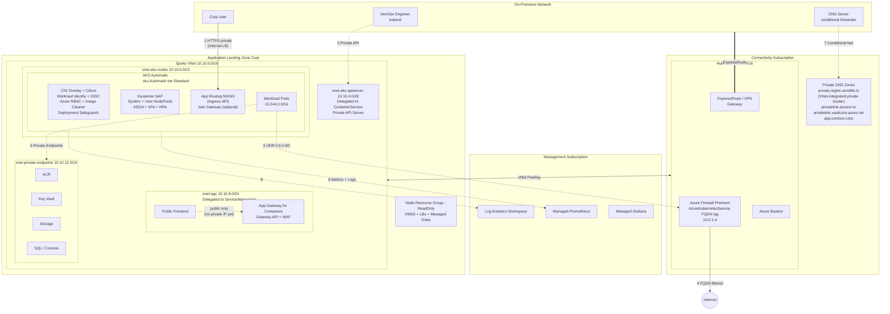

# AKS Automatic – Terraform (azapi) with ALZ Corp Integration

## Table of Contents

- [Overview](#overview)
- [AKS Automatic vs AKS Standard](#aks-automatic-vs-aks-standard)
- [Architecture](#architecture)
  - [ALZ Corp Architecture Diagram](#alz-corp-architecture-diagram)
  - [Traffic Flows](#traffic-flows)
- [AKS Automatic Components](#aks-automatic-components)
  - [SKU and Cluster Tier](#sku-and-cluster-tier)
  - [Node Provisioning (Karpenter)](#node-provisioning-karpenter)
  - [Networking](#networking)
  - [Ingress](#ingress)
  - [Egress](#egress)
  - [Security](#security)
  - [Monitoring and Observability](#monitoring-and-observability)
  - [Auto-Upgrade and Maintenance](#auto-upgrade-and-maintenance)
  - [Scaling](#scaling)
  - [Storage](#storage)
  - [Policy Enforcement](#policy-enforcement)
- [Preconfigured vs Fine-Tunable](#preconfigured-vs-fine-tunable)
- [BYO VNet Topology](#byo-vnet-topology)
- [Azure Landing Zone Caveats](#azure-landing-zone-caveats)
  - [VNet and Subnet Ownership](#vnet-and-subnet-ownership)
  - [CIDR Coordination](#cidr-coordination)
  - [Private DNS Zone Management](#private-dns-zone-management)
  - [Egress Through Hub Firewall](#egress-through-hub-firewall)
  - [Azure Policy Conflicts](#azure-policy-conflicts)
  - [azapi vs AVM Compatibility](#azapi-vs-avm-compatibility)
  - [RBAC and Identity Requirements](#rbac-and-identity-requirements)
  - [Monitoring Integration](#monitoring-integration)
- [Terraform Project Structure](#terraform-project-structure)
- [Deployment Scenarios](#deployment-scenarios)
- [Regional Availability and Limitations](#regional-availability-and-limitations)
- [References](#references)

---

## Overview

This repository contains a Terraform root module that deploys an **AKS Automatic** cluster using the **azapi provider** exclusively for all Azure resource creation. It is designed for deployment into an **Azure Landing Zone (ALZ) Corp** spoke subscription with private connectivity.

The module supports:

- BYO VNet target architecture with four subnets (nodes, API server, AGC, private endpoints); this module currently implements the node and API server subnets, with AGC and private endpoint subnets added as needed
- Three egress options: NAT Gateway, Standard Load Balancer, User-Defined Routing (hub firewall)
- Three ingress options: Application Gateway for Containers, Application Routing add-on, Istio
- Private cluster with VNet-integrated API server
- Full ALZ hub-spoke integration with Azure Firewall, Private DNS Zones, and ExpressRoute

---

## AKS Automatic vs AKS Standard

The ARM API difference between AKS Automatic and AKS Standard:

```json
{
  "sku": {
    "name": "Automatic",
    "tier": "Standard"
  },
  "properties": {
    "nodeProvisioningProfile": {
      "mode": "Auto"
    }
  }
}
```

AKS Standard uses `"sku": { "name": "Base" }` and `"nodeProvisioningProfile": { "mode": "Manual" }`.

In AKS Automatic, many features that are optional in Standard become **preconfigured** (immutable) or **default** (enabled but adjustable). See [Preconfigured vs Fine-Tunable](#preconfigured-vs-fine-tunable) for the full breakdown.

---

## Architecture

### ALZ Corp Architecture Diagram

The following diagram shows AKS Automatic deployed in an ALZ Corp spoke subscription with private connectivity. An editable DrawIO source is available at [`docs/alz-corp-aks-automatic.drawio`](docs/alz-corp-aks-automatic.drawio) ([open in diagrams.net](https://app.diagrams.net/#Uhttps%3A%2F%2Fraw.githubusercontent.com%2Fmartinopedal%2Fterraform-azapi-aks-automatic%2Fmain%2Fdocs%2Falz-corp-aks-automatic.drawio)).



### Traffic Flows

| # | Flow | Path | Notes |
|---|---|---|---|
| 1-2 | **Ingress (Corp)** | Corp User -> ExpressRoute -> Hub -> Peering -> Internal LB -> App Routing (NGINX) -> Pods | Fully private via internal LB. AGC not viable for Corp until private IP frontend ships. |
| 3-4 | **Egress** | Pods -> UDR -> Hub Azure Firewall -> Internet | FQDN-filtered via `AzureKubernetesService` tag |
| 5 | **API access** | DevOps -> ExpressRoute -> Hub -> Peering -> Private API Server | VNet-integrated ILB; private cluster FQDN: `<cluster>.private.<region>.azmk8s.io` |
| 6 | **PaaS access** | Pods -> Private Endpoints (ACR, Key Vault, SQL, Storage) | Workload Identity authentication |
| 7 | **DNS** | On-prem DNS -> Conditional Forwarder -> Hub Private DNS Zones | Resolves all private endpoints |
| 8 | **Monitoring** | AKS -> Managed Prometheus + Container Insights -> Log Analytics | Central management subscription |

---

## AKS Automatic Components

### SKU and Cluster Tier

| Property | Value | Notes |
|---|---|---|
| `sku.name` | `Automatic` | Triggers the Automatic experience |
| `sku.tier` | `Standard` | Always Standard tier, uptime SLA (99.95%), up to 5,000 nodes |
| Support plan | `KubernetesOfficial` | LTS available only on Premium tier with Standard SKU |

### Node Provisioning (Karpenter)

AKS Automatic uses **Node Autoprovisioning (NAP)** powered by Karpenter. No manually managed node pools exist. The cluster creates and right-sizes nodes based on pending pod resource requests.

| Property | Path | Configurable | Notes |
|---|---|---|---|
| Mode | `nodeProvisioningProfile.mode` | No, must be `Auto` | Core differentiator |
| Default pools | `nodeProvisioningProfile.defaultNodePools` | Yes (`None` / `Auto`) | Controls default Karpenter NodePool CRDs |
| System pool | `agentPoolProfiles[0]` | Partially | VM size dynamically selected based on quota |
| Node OS | Azure Linux | No | Preconfigured, immutable |
| Node auto-repair | Enabled | No | Preconfigured |
| Node resource group | ReadOnly | No | Locked to prevent changes |

Post-deployment tuning via Karpenter CRDs:

- `NodePool` CRDs: VM families, spot vs on-demand, taints, labels, topology spread, `.spec.limits` for vCPU/memory caps
- `AKSNodeClass` CRDs: OS disk type/size, node image version

### Networking

AKS Automatic uses **Azure CNI Overlay powered by Cilium** with eBPF-based data plane and integrated network policy enforcement.

| Component | Setting | Configurable |
|---|---|---|
| Network plugin | `azure` (CNI Overlay) | No |
| Network plugin mode | `overlay` | No |
| Network dataplane | `cilium` | No |
| Network policy engine | `cilium` | No |
| Load balancer SKU | `standard` | No |
| API server VNet integration | Enabled | No |
| Pod CIDR | Default `10.244.0.0/16` | Yes - `networkProfile.podCidr` |
| Service CIDR | Default `10.0.0.0/16` | Yes - `networkProfile.serviceCidr` |
| DNS service IP | Auto-assigned | Yes - `networkProfile.dnsServiceIP` |
| VNet | Managed (auto-created) | Yes - BYO VNet supported |
| Outbound type | `managedNATGateway` | Yes - see [Egress](#egress) |
| Service mesh | Not enabled | Yes - `serviceMeshProfile` for Istio |

### Ingress

AKS Automatic supports three ingress options, but they do not all use the same API model today. AGC uses the Kubernetes Gateway API. Application Routing currently uses Kubernetes `Ingress` resources. The AKS Istio add-on currently uses Istio CRDs for ingress and traffic management.

> **Ingress NGINX retirement notice:** The upstream Ingress NGINX project maintenance ended March 2026. Microsoft provides security patches for the Application Routing add-on NGINX through November 2026. AKS is migrating to the Kubernetes Gateway API as the long-term ingress standard. Plan migration to AGC (when private IP ships) or other Gateway API-compatible controllers.

#### Application Gateway for Containers (Gateway API, L7)

> **Limitation (as of March 2026):** Two blockers currently prevent AGC use on AKS Automatic in Corp scenarios:
>
> 1. **The AGC AKS add-on is not yet supported on AKS Automatic clusters.** The add-on is available on AKS Standard only. Based on product group signals, support for AKS Automatic is expected in the near future. See [AGC ALB Controller Add-on](https://learn.microsoft.com/azure/application-gateway/for-containers/quickstart-deploy-application-gateway-for-containers-alb-controller-addon).
> 2. **AGC frontends do not support private IP addresses.** Frontends only expose a public FQDN. Based on public signals from the AGC product team, private ingress support is actively in development and is expected in the near future. See [AGC Components - Frontends](https://learn.microsoft.com/azure/application-gateway/for-containers/application-gateway-for-containers-components).
>
> No official timelines or GA dates have been committed for either feature — plan accordingly and do not take dependencies on unannounced features.
>
> For ALZ Corp scenarios requiring fully private ingress today, use **Application Routing add-on with internal LB** or **Istio ingress gateway in Internal mode**.

AGC is Azure's L7 load balancer for AKS, built on the Kubernetes Gateway API. Once the AKS Automatic add-on and private IP frontend support ship, AGC will be the recommended Corp ingress option due to its WAF, mTLS, and traffic splitting capabilities.

```
Client -> AGC Public Frontend -> ALB Controller -> Pods
```

| Aspect | Detail |
|---|---|
| AKS integration | AKS managed add-on (**not yet available on AKS Automatic**, supported on AKS Standard) |
| Subnet | Dedicated subnet delegated to `Microsoft.ServiceNetworking/trafficControllers`, minimum /24 |
| Frontend | **Public FQDN only** (private IP not yet supported) |
| API model | `GatewayClass`, `Gateway`, `HTTPRoute` CRDs |
| WAF | Optional WAF policy on AGC security policy resource |
| TLS | SSL termination, ECDSA + RSA, end-to-end SSL, mTLS |
| Traffic splitting | Weighted round-robin via `HTTPRoute` weights (canary, blue-green) |
| Identity | `applicationloadbalancer-<cluster>` managed identity, auto-configured by add-on |
| Deployment modes | ALB-managed (`ApplicationLoadBalancer` CRD) or BYO (Terraform/ARM provisioned) |

#### Application Routing Add-on (managed NGINX / Ingress API, preconfigured) - recommended for ALZ Corp

Always enabled on AKS Automatic. Deploys a managed NGINX-based controller that currently uses `Ingress` resources with `ingressClassName: webapprouting.kubernetes.azure.com`. Supports **internal Azure Load Balancer** for fully private ingress.

```
Corp User -> ExpressRoute -> Peering -> Internal LB -> App Routing Ingress -> Pods
```

| Feature | Configuration |
|---|---|
| Current API | `Ingress` with `ingressClassName: webapprouting.kubernetes.azure.com` |
| DNS integration | `ingressProfile.webAppRouting.dnsZoneResourceIds` (public and private zones) |
| TLS from Key Vault | Reference certs on `Ingress` resources with `kubernetes.azure.com/tls-cert-keyvault-uri`, automatic rotation |
| Internal-only | `service.beta.kubernetes.io/azure-load-balancer-internal: "true"` annotation on Service |
| Private frontend | ✅ Fully supported via internal Azure Load Balancer |

Corp considerations: Configure as internal LB only. Create DNS records in the hub Private DNS Zone pointing to the internal LB IP. This is the recommended ingress for ALZ Corp until AGC adds private IP frontend support. AKS will evolve Application Routing toward Gateway API alignment, but it does not use `GatewayClass`, `Gateway`, or `HTTPRoute` today.

#### Istio Service Mesh Ingress Gateway (optional)

Envoy-based ingress for service mesh scenarios. Traffic management uses Istio `VirtualService` and `DestinationRule` CRDs, and ingress exposure is configured via the Istio `Gateway` CRD (not the Kubernetes Gateway API). Supports **internal mode** for fully private ingress.

```
Corp User -> ExpressRoute -> Peering -> Internal Istio Gateway -> VirtualService -> Pods
```

| Component | Configuration |
|---|---|
| Enable | `serviceMeshProfile.mode = "Istio"` |
| Ingress gateway | `istio.components.ingressGateways[].enabled = true` |
| Internal mode | Set `mode: "Internal"` for corp-only access |
| Current API | Istio `Gateway`, `VirtualService`, and `DestinationRule` CRDs |
| mTLS | `PeerAuthentication` CRDs |
| Private frontend | ✅ Fully supported via internal Azure Load Balancer |

Corp considerations: Use `Internal` mode. When combined with UDR egress, the hub firewall must allow return traffic to the Istio LB frontend IP. Kubernetes Gateway API support in the AKS Istio add-on is planned but not yet available.

#### Ingress Comparison

| | AGC | App Routing (NGINX) | Istio Gateway |
|---|---|---|---|
| AKS Automatic support | ❌ add-on not yet available | ✅ preconfigured | ✅ opt-in |
| Gateway API | ✅ | Ingress API (Gateway API planned) | Istio Gateway CRD (K8s Gateway API planned) |
| L7 features | WAF, mTLS, rewrites, traffic splits | Host/path routing, TLS | Traffic mgmt, mTLS, fault injection |
| Private IP frontend | ❌ not yet supported | ✅ internal LB | ✅ internal mode |
| ALZ Corp recommended | ❌ until add-on + private IP ship | **✅ Primary for Corp** | ✅ Service mesh scenarios |
| Managed by | Azure (AGC resource) | AKS (in-cluster) | AKS (in-cluster) |

### Egress

In an ALZ Corp deployment, the standard pattern is **UDR through the hub Azure Firewall**. Four egress options are available depending on the VNet configuration.

#### Managed NAT Gateway (managed VNet only)

```
Pods -> Node -> Managed NAT Gateway -> Internet
```

- `enable_byo_vnet = false`
- AKS creates and manages the NAT Gateway. No configuration available.
- Not suitable for Corp: egress is unfiltered with no centralised logging.

#### User-Assigned NAT Gateway (BYO VNet)

```
Pods -> Node -> NAT Gateway -> Public IP -> Internet
```

- `egress_type = "userAssignedNATGateway"`
- Creates Public IP + NAT Gateway associated to the node subnet.
- 64k SNAT ports per public IP, deterministic outbound IP.
- `nat_gateway_idle_timeout` configurable (4-120 minutes).
- No centralised FQDN filtering. Combine with Cilium L7 policies for in-cluster egress control.

#### Standard Load Balancer (BYO VNet, dev/test only)

```
Pods -> Node -> AKS Standard LB (SNAT) -> Internet
```

- `egress_type = "loadBalancer"`
- No additional resources created.
- Limited SNAT ports (~1k per node), no static outbound IP, SNAT exhaustion risk.

#### User-Defined Routing (BYO VNet, recommended for ALZ Corp)

```
Pods -> Node -> UDR 0.0.0.0/0 -> Hub Azure Firewall -> Internet
```

- `egress_type = "userDefinedRouting"`, `firewall_private_ip` required.
- Creates Route Table with default route to the hub firewall private IP.
- Centralised FQDN filtering, compliance logging, DLP.

**Required outbound FQDNs** (Azure Firewall `AzureKubernetesService` FQDN tag covers most):

| FQDN | Port | Purpose |
|---|---|---|
| `*.hcp.<region>.azmk8s.io` | 443 | API server communication for public clusters |
| `mcr.microsoft.com` | 443 | System container images |
| `*.data.mcr.microsoft.com` | 443 | MCR data endpoint |
| `mcr-0001.mcr-msedge.net` | 443 | MCR CDN endpoint |
| `management.azure.com` | 443 | Azure Resource Manager |
| `login.microsoftonline.com` | 443 | Entra ID authentication |
| `packages.microsoft.com` | 443 | Azure Linux packages |
| `acs-mirror.azureedge.net` | 443 | Azure Linux mirror |
| `dc.services.visualstudio.com` | 443 | Container Insights telemetry |
| `*.monitoring.azure.com` | 443 | Managed Prometheus |
| `*.ods.opinsights.azure.com` | 443 | Log Analytics ingestion |

> **Note:** `*.hcp.<region>.azmk8s.io` is not required for private clusters.

Additional rules beyond the FQDN tag:

| FQDN | Purpose |
|---|---|
| `<acr-name>.azurecr.io` | Application container images |
| Helm chart registries | Third-party charts |
| Workload-specific external APIs | Application dependencies |

Azure Firewall sizing: minimum 20 frontend public IPs in production to avoid SNAT exhaustion. The route table applies to the **node subnet only**. The API server subnet must not have a route table.

#### Egress Comparison

| | Managed NAT GW | User NAT GW | Load Balancer | UDR |
|---|---|---|---|---|
| BYO VNet | ❌ | ✅ | ✅ | ✅ |
| Static outbound IP | ❌ | ✅ | ❌ | Via firewall |
| SNAT ports | High (auto) | 64k per PIP | ~1k per node | Via firewall |
| Centralised filtering | ❌ | ❌ | ❌ | ✅ |
| ALZ Corp suitable | ❌ | Partial | ❌ | ✅ |
| Terraform variable | default | `userAssignedNATGateway` | `loadBalancer` | `userDefinedRouting` |

### Security

| Component | Setting | Configurable |
|---|---|---|
| Authentication and authorisation | Azure RBAC for Kubernetes | No, local accounts disabled |
| Workload Identity | Entra Workload ID | No |
| OIDC Issuer | Enabled | No |
| API server VNet integration | Enabled | No |
| Image Cleaner | Enabled, default 7-day interval | Yes - `image_cleaner_interval_hours` |
| Deployment Safeguards | Azure Policy, Warning mode | No (severity adjustable via Policy) |
| Defender for Containers | Optional | Yes - `securityProfile.defender` |
| Azure Key Vault KMS | Optional | Yes - `securityProfile.azureKeyVaultKms` |
| Custom CA trust certs | Optional, up to 10 | Conditional - see caveat below |
| Private cluster | Optional | Yes - `enable_private_cluster` |
| Authorised IP ranges | Optional | Yes - `authorized_ip_ranges` |

> **Custom CA trust certificates:** Supported on NAP-enabled AKS Automatic clusters starting with AKS release v20260408. Use `securityProfile.customCATrustCertificates` only when the cluster version is >= v20260408. See [GitHub issue #5353](https://github.com/Azure/AKS/issues/5353).

### Monitoring and Observability

| Component | Default State | Configurable |
|---|---|---|
| Managed Prometheus | Enabled (CLI/Portal) | Yes - `enable_prometheus` |
| Container Insights | Enabled (CLI/Portal) | Yes |
| Azure Monitor Dashboards | Built-in via portal | Yes - link Managed Grafana |
| ACNS network observability | Not enabled | Yes - `advancedNetworking` |
| Cost analysis | Not enabled | Yes - `metricsProfile.costAnalysis` |

### Auto-Upgrade and Maintenance

| Component | Setting | Configurable |
|---|---|---|
| Cluster auto-upgrade | `stable` channel | Yes - `upgrade_channel` |
| Node OS upgrade | `NodeImage` channel | Yes - `node_os_upgrade_channel` |
| K8s API deprecation detection | Enabled | No |
| Planned maintenance windows | Configurable | Yes - `maintenanceConfigurations` |

### Scaling

| Component | Setting | Configurable |
|---|---|---|
| Node Autoprovisioning (NAP) | Enabled | No |
| HPA | Enabled | Yes - per deployment |
| KEDA | Enabled | Yes - `workloadAutoScalerProfile.keda` |
| VPA | Enabled | Yes - `workloadAutoScalerProfile.verticalPodAutoscaler` |
| Cluster autoscaler profile | Available | Yes - `autoScalerProfile.*` |

### Storage

| Component | Default | Configurable |
|---|---|---|
| Azure Disk CSI | Enabled | Yes - `storageProfile.diskCSIDriver` |
| Azure Files CSI | Enabled | Yes - `storageProfile.fileCSIDriver` |
| Azure Blob CSI | Disabled | Yes - `storageProfile.blobCSIDriver` |
| Snapshot controller | Enabled | Yes - `storageProfile.snapshotController` |

### Policy Enforcement

| Component | Setting | Configurable |
|---|---|---|
| Deployment Safeguards | Warning mode | Severity changeable to Enforcement |
| Custom Azure Policies | Not assigned | Yes |
| Managed namespaces | Not enabled | Yes |

---

## Preconfigured vs Fine-Tunable

### Preconfigured (immutable)

The following are always enabled on AKS Automatic and cannot be disabled or changed:

- Node Autoprovisioning mode = `Auto`
- Azure Linux node OS
- Azure CNI Overlay + Cilium
- Azure RBAC for Kubernetes authorisation (local accounts disabled)
- Workload Identity + OIDC Issuer
- API server VNet integration
- Image Cleaner
- Deployment Safeguards (Azure Policy)
- Managed NAT Gateway (when using managed VNet)
- Application Routing add-on (managed NGINX)
- Node auto-repair
- Standard tier with uptime SLA
- ReadOnly node resource group
- K8s API deprecation detection on upgrade

### Fine-tunable

| Category | Parameters |
|---|---|
| Kubernetes version | `kubernetes_version` |
| Upgrade channels | `upgrade_channel`, `node_os_upgrade_channel` |
| Maintenance windows | `maintenanceConfigurations` |
| Networking | BYO VNet, pod/service CIDRs, DNS service IP |
| Egress | NAT Gateway, Load Balancer, or UDR (BYO VNet) |
| Ingress | AGC add-on, DNS zones for App Routing, Istio |
| Private cluster | `enable_private_cluster`, `authorized_ip_ranges` |
| Monitoring | Prometheus, Container Insights, Managed Grafana |
| Scaling | KEDA, VPA, HPA, autoscaler profile |
| Storage | Disk/File/Blob CSI drivers, snapshot controller |
| Security | Defender, Key Vault KMS, image cleaner interval, CA trust certs (requires AKS >= v20260408 for NAP) |
| Node customisation | Karpenter `NodePool` / `AKSNodeClass` CRDs post-deployment |

---

## BYO VNet Topology

This section shows the target ALZ Corp topology. The module currently implements the node and API server subnets. Add the AGC and private-endpoint subnets when deploying AGC or PaaS services that use private endpoints.

```
Spoke VNet: 10.10.0.0/16 (peered to Hub VNet)

  snet-aks-nodes         10.10.0.0/22    NSG + UDR -> Hub Firewall
    AKS Automatic cluster
      System Pool + Karpenter NodePools (Azure Linux)
      App Routing (Ingress API) | Istio | AGC (optional, public frontend today)
      Pods (overlay: 10.244.0.0/16, services: 10.245.0.0/16)

  snet-aks-apiserver     10.10.4.0/28    Delegated: Microsoft.ContainerService/managedClusters
    K8s API Server (VNet integrated ILB; FQDN: <cluster>-<hash>.<region>.azmk8s.io)
    Private cluster uses the private.<region>.azmk8s.io DNS zone

  snet-agc               10.10.8.0/24    Delegated: Microsoft.ServiceNetworking/trafficControllers
    Application Gateway for Containers (public frontend today)

  snet-private-endpoints 10.10.12.0/24
    Private Endpoints: ACR, Key Vault, Storage, SQL/CosmosDB
```

### Subnet Sizing

| Subnet | Minimum | Recommended | Notes |
|---|---|---|---|
| Node subnet | /24 (254 nodes) | /22 (1,022 nodes) | One IP per node. Pod IPs from overlay, not this subnet. |
| API server subnet | /28 (11 usable) | /28 | API server endpoint only. /28 is sufficient. |
| AGC subnet | /24 (256 IPs) | /24 | Required by AGC. Dedicated and delegated. |
| Private endpoints | /24 | /24 | ACR, Key Vault, Storage, database PEs. |

### Subnet Requirements

- The API server subnet MUST have delegation to `Microsoft.ContainerService/managedClusters`.
- The API server subnet MUST NOT have a NAT Gateway or Route Table.
- The AGC subnet MUST have delegation to `Microsoft.ServiceNetworking/trafficControllers`.
- The node subnet SHOULD have an NSG and a UDR for Corp egress.
- All subnets must be in the same VNet and region.
- No CIDR overlaps between VNet address space, pod CIDR, service CIDR, hub VNet, and on-premises networks.

---

## Azure Landing Zone Caveats

This module deploys into a **Corp spoke subscription** within an Azure Landing Zone using [Azure Verified Modules (AVM) for Platform Landing Zones](https://aka.ms/alz/acc/tf). The following caveats and implementation considerations apply.

### VNet and Subnet Ownership

In ALZ, the connectivity subscription owns the hub VNet and the platform team manages peering. This module creates its own spoke VNet in `network.tf`.

**What you must handle externally:**

- Peer the spoke VNet to the ALZ hub. This module does not create peering resources.
- If the platform team pre-provisions spoke VNets, set `enable_byo_vnet = false` and modify `locals.tf` to accept external subnet IDs via variables instead of referencing `azapi_resource.node_subnet[0].id`.

### CIDR Coordination

ALZ enforces centralised IP address management (IPAM). The default CIDRs in this module (`10.10.0.0/16` VNet, `10.244.0.0/16` pod overlay, `10.245.0.0/16` services) must not overlap with:

- Hub VNet CIDR (typically `10.0.0.0/16`)
- Other spoke VNets
- On-premises address space connected via ExpressRoute or VPN
- Other AKS clusters sharing DNS or service mesh

**Action:** Coordinate all CIDR allocations with the ALZ platform team before deployment. Update `variables.tf` defaults to match allocated ranges.

### Private DNS Zone Management

AKS Automatic always uses **API Server VNet Integration**. The API server runs behind an internal load balancer (ILB) injected directly into the delegated API server subnet. This is not the legacy Private Link-based model.

DNS resolution depends on whether the cluster is public or private:

| Mode | FQDN format | Resolves to | Private DNS Zone |
|---|---|---|---|
| Public | `<cluster>-<hash>.<region>.azmk8s.io` | Public IP | Not required |
| Private | `<cluster>-<hash>.private.<region>.azmk8s.io` | ILB private IP in API server subnet | `private.<region>.azmk8s.io` |

In both modes, nodes communicate with the API server via the ILB private IP directly, bypassing DNS entirely. The DNS zone is only relevant for out-of-cluster clients (kubectl, CI/CD pipelines, on-premises users).

The `privateDNSZone` property (ARM) / `--private-dns-zone` flag (CLI) controls zone creation for private clusters:

| Setting | Behaviour |
|---|---|
| `system` (default) | AKS creates a `private.<region>.azmk8s.io` zone in the node resource group, linked to the cluster VNet only. |
| `none` | No zone created. API server reachable only via public FQDN (if public access is also enabled). |
| `<resource-id>` | Use a pre-created zone in e.g. the ALZ connectivity subscription. Format: `private.<region>.azmk8s.io`. |

**Implementation guidance for ALZ hub-spoke:**

- Use `privateDNSZone = "<resource-id>"` pointing to a pre-created `private.<region>.azmk8s.io` zone in the connectivity subscription. The zone must be linked to both hub and spoke VNets.
- The cluster managed identity requires `Private DNS Zone Contributor` and `Network Contributor` on the zone.
- On-premises DNS servers need a conditional forwarder for `private.<region>.azmk8s.io` to Azure DNS (`168.63.129.16`) via the hub.
- For public VNet-integrated clusters: no Private DNS Zone is needed. Restrict external access using `authorized_ip_ranges`.
- For Application Routing DNS: pass pre-existing zone resource IDs via `dns_zone_resource_ids`. The AKS managed identity requires `Private DNS Zone Contributor` on private zones and `DNS Zone Contributor` on public zones.
- For AGC frontends: add a CNAME in the appropriate Private DNS Zone pointing to the generated `*.appgw.azure.com` FQDN.

**Sources:**
- [API Server VNet Integration](https://learn.microsoft.com/azure/aks/api-server-vnet-integration) - ILB-based model, DNS behaviour, public/private toggle
- [Private AKS clusters](https://learn.microsoft.com/azure/aks/private-clusters) - `privateDNSZone` options, hub-spoke DNS configuration
- [AKS Automatic private cluster quickstart](https://learn.microsoft.com/azure/aks/automatic/quick-automatic-private-custom-network) - Identity and subnet requirements

### Egress Through Hub Firewall

The standard ALZ Corp pattern routes all spoke egress through the hub Azure Firewall via UDR.

**Configuration:** Set `egress_type = "userDefinedRouting"` and `firewall_private_ip` to the hub firewall's private IP.

**Firewall policy requirements:**

The `AzureKubernetesService` FQDN tag on Azure Firewall covers most AKS system requirements. Additional rules are needed for:

- Container registries: `<acr-name>.azurecr.io`, `ghcr.io`, `docker.io`
- Helm chart repositories
- External APIs consumed by workloads
- Azure Linux packages: `packages.microsoft.com`, `acs-mirror.azureedge.net`, `mcr-0001.mcr-msedge.net`

If the ALZ uses a third-party NVA instead of Azure Firewall, the `AzureKubernetesService` FQDN tag is not available. Each required FQDN must be whitelisted individually per the [AKS required outbound rules](https://learn.microsoft.com/azure/aks/outbound-rules-control-egress).

### Azure Policy Conflicts

ALZ assigns Azure Policies at the management group level. AKS Automatic preconfigures Deployment Safeguards which internally uses Azure Policy. Conflicts between ALZ policies and AKS Automatic defaults can cause cluster creation failures.

**Known conflict areas:**

| ALZ Policy | Conflict |
|---|---|
| `Kubernetes clusters should not allow container privilege escalation` | May block AKS system components |
| `Kubernetes cluster should not allow privileged containers` | AKS system pods require privileges |
| `Network policies should be enforced on AKS clusters` | Already enforced by Cilium but policy may not detect this |
| Policies enforcing specific NSG rules | AKS injects its own NSG rules that may violate strict policies |
| Policies denying public IPs on subnets | NAT Gateway requires a public IP resource |

**Action:** Audit ALZ policy assignments before deploying:

```bash
az policy assignment list --scope /subscriptions/<subscription-id> --output table
```

Request exemptions from the platform team for policies incompatible with AKS Automatic.

### azapi vs AVM Compatibility

This module uses `azapi_resource` for all Azure resources. AVM modules use `azurerm_*` resources.

**Rules:**

- Do not manage the same resource with both `azapi_resource` and `azurerm_*` in separate configurations. This causes state conflicts and drift.
- Reference AVM-managed resources (VNet, Key Vault, DNS Zones) via data sources or resource ID variables, not by importing into this Terraform state.
- When the ALZ platform team uses the [AVM Platform Landing Zone module](https://registry.terraform.io/modules/Azure/avm-ptn-alz/azurerm/latest), coordinate output values: hub firewall IP, peering resource IDs, Private DNS zone IDs, Log Analytics workspace ID.

### RBAC and Identity Requirements

AKS Automatic enforces Azure RBAC for Kubernetes (`aadProfile.enableAzureRBAC = true`, local accounts disabled).

The cluster's SystemAssigned managed identity requires the following role assignments, which are **not created by this module**:

| Role | Scope | Purpose |
|---|---|---|
| `Network Contributor` | BYO VNet and subnets | Node provisioning, subnet joins |
| `Private DNS Zone Contributor` | Private DNS zones in connectivity subscription | Application Routing private DNS record management |
| `DNS Zone Contributor` | Public DNS zones | Application Routing public DNS record management |
| `Key Vault Certificate User` | Key Vault(s) for TLS certs | Application Routing TLS certificate retrieval |
| `AcrPull` | Azure Container Registry | Pull application container images |

In ALZ, these are cross-subscription RBAC assignments that must be managed by the platform team or a separate Terraform state.

### Monitoring Integration

ALZ deploys a central Log Analytics workspace in the management subscription. To forward AKS Container Insights and Prometheus data to the central workspace, the workspace resource ID must be added to the cluster's `azureMonitorProfile` or `addonProfiles`. This module does not currently wire central workspace integration. Extend `main.tf` if centralised logging is required.

### If Using ALZ Subscription Vending with AVNM IPAM

If the ALZ platform uses the [AVM Subscription Vending module](https://github.com/Azure/bicep-registry-modules/tree/main/avm/ptn/lz/sub-vending) to provision application landing zone subscriptions, and the network team has customised it with [Azure Virtual Network Manager (AVNM) IPAM](https://learn.microsoft.com/azure/virtual-network-manager/concept-ip-address-management) for centralised IP address allocation, the following considerations change compared to the default BYO VNet path documented above.

**VNet and subnets are pre-provisioned by the vending pipeline.** The subscription vending module creates the spoke VNet, subnets, hub peering, NSG, and UDR as part of the landing zone provisioning — before this AKS module runs. This module's `enable_byo_vnet = true` path (which creates its own VNet in `network.tf`) would conflict with that. Instead, set `enable_byo_vnet = false` and pass the pre-existing subnet resource IDs directly. This requires adding `node_subnet_id` and `apiserver_subnet_id` input variables to `locals.tf` to replace the current `azapi_resource.node_subnet[0].id` references. The module does not implement this path today — it is a documented extension point.

**CIDR ranges are allocated from AVNM IPAM pools, not manually.** The `vnet_address_space`, `node_subnet_address_prefix`, and `apiserver_subnet_address_prefix` variables become irrelevant — the vending pipeline controls these via IPAM pool reservations. The overlay CIDRs (`pod_cidr`, `service_cidr`) are not part of the VNet address space (they exist in the overlay) but still must not overlap with any routable address space in the IPAM plan. Coordinate these with the network team.

**Subnet delegations must be configured in the vending pipeline.** The API server subnet requires delegation to `Microsoft.ContainerService/managedClusters` and the AGC subnet requires delegation to `Microsoft.ServiceNetworking/trafficControllers`. These delegations must be part of the vending module's subnet definitions, not applied by this module after the fact.

**Peering and route tables are handled by the vending pipeline.** The subscription vending module typically creates hub-spoke peering and attaches the UDR (pointing to the hub firewall) to the node subnet as part of provisioning. The NSG, route table, and NAT Gateway resources in `network.tf` are not needed.

**Terraform state boundaries.** The vending module uses `azurerm` (AVM convention). This module uses `azapi`. They operate in separate Terraform states. Pass subnet IDs as input variables — do not use `data` source lookups across states, as that creates implicit dependencies that break when the vending pipeline runs independently.

**Summary of what changes:**

| Concern | Default BYO VNet (this module) | Subscription Vending + AVNM IPAM |
|---|---|---|
| VNet creation | This module (`network.tf`) | Vending pipeline |
| Subnet creation | This module (`network.tf`) | Vending pipeline |
| CIDR allocation | Manual (`variables.tf` defaults) | AVNM IPAM pools |
| Subnet delegations | This module (`network.tf`) | Vending pipeline subnet definitions |
| Hub peering | External (manual) | Vending pipeline (automatic) |
| NSG + UDR | This module (`network.tf`) | Vending pipeline / AVNM security admin rules |
| Input to this module | `enable_byo_vnet = true` | `enable_byo_vnet = false` + external subnet ID variables (extension needed) |
| Terraform provider | `azapi` | Vending uses `azurerm`, this module uses `azapi` — separate states |

---

## Terraform Project Structure

```
aks-automatic-azapi/
├── terraform.tf              # Terraform block, providers
├── data.tf                   # Data sources (client config, subscription)
├── locals.tf                 # Computed values, conditional logic
├── variables.tf              # All input variables
├── network.tf                # BYO VNet resources (conditional)
├── main.tf                   # Resource group + AKS cluster
├── outputs.tf                # Outputs
├── terraform.tfvars.example  # Example values for common scenarios
├── .github/
│   └── copilot-instructions.md
├── docs/
│   └── alz-corp-aks-automatic.drawio
└── README.md
```

| File | Responsibility |
|---|---|
| `terraform.tf` | Terraform version constraint, azapi + azurerm provider declarations |
| `data.tf` | Read-only data sources for Azure context |
| `locals.tf` | Derived values: network conditionals, subnet IDs, outbound type |
| `variables.tf` | All configurable inputs with descriptions, types, defaults, validations |
| `network.tf` | All BYO VNet resources, conditionally created when `enable_byo_vnet = true` |
| `main.tf` | Resource group (azapi) + AKS Automatic cluster (azapi) |
| `outputs.tf` | Exported values: FQDN, OIDC URL, subnet IDs, resource IDs |
| `terraform.tfvars.example` | Copy to `terraform.tfvars` and customise |

### Why azapi

The azapi provider communicates directly with the Azure Resource Manager REST API:

- Day-zero support for new API versions and preview features
- No dependency on azurerm provider release cycle for new AKS properties
- Full control over the JSON body sent to ARM
- Required for `sku.name = "Automatic"` which is not yet in all azurerm versions

---

## Deployment Scenarios

### Prerequisites

- Terraform >= 1.9
- Azure CLI authenticated (`az login`)
- Subscription quota for 16+ vCPUs of D-series VMs in the target region
- Region must support API Server VNet Integration (GA)
- `Microsoft.PolicyInsights` resource provider registered

### Quick Start

```bash
cp terraform.tfvars.example terraform.tfvars
# Edit terraform.tfvars for your environment

terraform init
terraform validate
terraform plan
terraform apply
```

### Scenario 1: BYO VNet + NAT Gateway

```hcl
enable_byo_vnet = true
egress_type     = "userAssignedNATGateway"
```

### Scenario 2: BYO VNet + UDR through Hub Firewall (ALZ Corp)

```hcl
enable_byo_vnet     = true
egress_type         = "userDefinedRouting"
firewall_private_ip = "10.0.1.4"
```

### Scenario 3: Managed VNet

```hcl
enable_byo_vnet = false
```

### Scenario 4: Private Cluster

```hcl
enable_byo_vnet        = true
enable_private_cluster = true
egress_type            = "userDefinedRouting"
firewall_private_ip    = "10.0.1.4"
```

### Scenario 5: Application Routing with DNS

```hcl
dns_zone_resource_ids = [
  "/subscriptions/<sub>/resourceGroups/<rg>/providers/Microsoft.Network/dnsZones/app.contoso.corp"
]
```

### Connect to the Cluster

```bash
az aks get-credentials --resource-group rg-aks-automatic --name aks-automatic
kubectl get nodes
```

---

## Regional Availability and Limitations

- Regions must support 3+ availability zones, ephemeral OS disk, and Azure Linux.
- API Server VNet Integration must be GA in the target region.
- System node pool VM size is dynamically selected. Ensure quota for at least one of: `Standard_D4lds_v5`, `Standard_D4ads_v5`, `Standard_D4ds_v5`, `Standard_D4d_v5`, `Standard_DS3_v2`.
- Windows node pools are not supported.
- The node resource group is ReadOnly.

---

## References

- [What is AKS Automatic?](https://learn.microsoft.com/azure/aks/intro-aks-automatic)
- [Create an AKS Automatic cluster](https://learn.microsoft.com/azure/aks/learn/quick-kubernetes-automatic-deploy)
- [AKS Automatic with custom VNet](https://learn.microsoft.com/azure/aks/automatic/quick-automatic-custom-network)
- [AKS Automatic private cluster](https://learn.microsoft.com/azure/aks/automatic/quick-automatic-private-custom-network)
- [Application Gateway for Containers](https://learn.microsoft.com/azure/application-gateway/for-containers/overview)
- [AGC ALB Controller add-on](https://learn.microsoft.com/azure/application-gateway/for-containers/quickstart-deploy-application-gateway-for-containers-alb-controller-addon)
- [Kubernetes Gateway API](https://gateway-api.sigs.k8s.io/)
- [AKS required outbound FQDNs](https://learn.microsoft.com/azure/aks/outbound-rules-control-egress)
- [AKS REST API - Managed Clusters](https://learn.microsoft.com/rest/api/aks/managed-clusters/create-or-update)
- [azapi provider](https://registry.terraform.io/providers/azure/azapi/latest/docs)
- [Node Autoprovisioning](https://learn.microsoft.com/azure/aks/node-autoprovision)
- [Azure CNI Overlay with Cilium](https://learn.microsoft.com/azure/aks/azure-cni-powered-by-cilium)
- [Application Routing add-on](https://learn.microsoft.com/azure/aks/app-routing)
- [API Server VNet Integration](https://learn.microsoft.com/azure/aks/api-server-vnet-integration)
- [Azure Landing Zone Terraform Accelerator](https://aka.ms/alz/acc/tf)
- [Azure Verified Modules](https://azure.github.io/Azure-Verified-Modules/)
